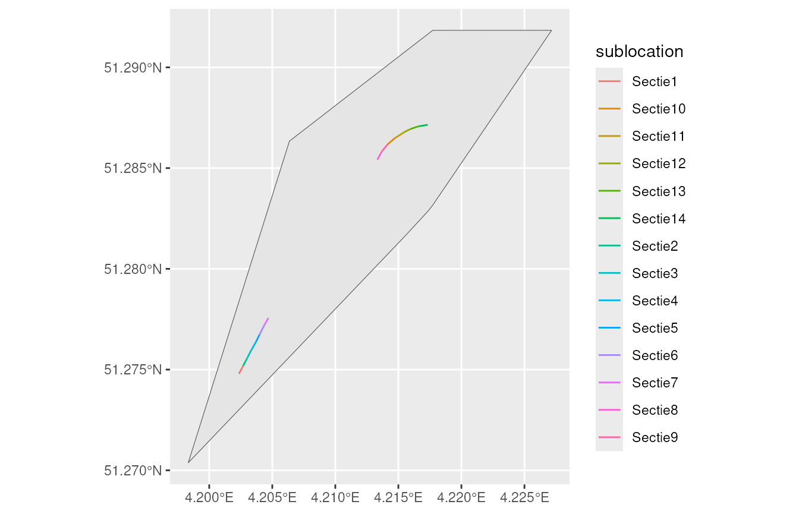
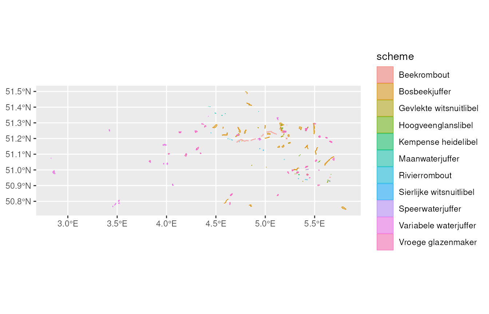

# How to retrieve data from the Meetnetten database

## Introduction

The Flemish species monitoring programme
[Meetnetten.be](https://www.meetnetten.be) consists of a set of
monitoring schemes for priority species in Flanders, the northern part
of Belgium. The monitoring programme is a collaboration between the
Nature and Forest Research Institute (INBO), the Nature and Forest
Agency (ANB), the NGO Natuurpunt and many volunteers.

Each monitoring scheme consists of a number of monitoring sites at which
target species are counted using a standardized protocol. The count data
is stored in the Meetnetten database which is maintained by INBO. We
present some functions to easily access the data from the Meetnetten
database.

## Aim

We make functions available to query data directly from the Meetnetten
database. This avoids writing your own queries.

We have provided functions to query

- monitoring schemes included in the species monitoring programme
- locations and sublocations (for example different sections of a
  transect) of the monitoring schemes
- visits (count events)
- observations

## Packages and connection

The main functions that we will use in this tutorial all start with
`get_meetnetten_*`. These functions are made available by loading the
`inbodb` package.

``` r

library(inbodb)
library(dplyr)
library(sf)
library(ggplot2)
```

These functions will only work for people with access to the INBO
network. As an INBO employee, you should make sure you have read rights
for the INBO Data Warehouse server, otherwise place an ICT-call.

The following R-code can be used to establish a connection to the
Meetnetten database:

``` r

con <- connect_inbo_dbase("S0008_00_Meetnetten")
```

## Functionality

### Information on monitoring schemes

The function
[`get_meetnetten_schemes()`](https://inbo.github.io/inbodb/reference/get_meetnetten_schemes.md)
gives an overview per species group of all monitoring schemes included
in Meetnetten and the protocols that are applied in the monitoring
schemes.

In most cases, a monitoring scheme is dedicated to one target species
and the monitoring scheme is named after the target species. In some
cases, a monitoring scheme has several target species, such as the
`Algemene Broedvogelmonitoring Vlaanderen`.

``` r

scheme_info <- get_meetnetten_schemes(con) %>%
  as_tibble()
```

``` r

scheme_info
#> # A tibble: 89 × 3
#>    species_group scheme        protocol                        
#>    <chr>         <chr>         <chr>                           
#>  1 amfibieën     Boomkikker    Amfibieën - Larven en metamorfen
#>  2 amfibieën     Boomkikker    Padden en kikkers - Roepkoren   
#>  3 amfibieën     Heikikker     Heikikker - DNA eitjes          
#>  4 amfibieën     Kamsalamander Amfibieën - Fuiken              
#>  5 amfibieën     Kamsalamander Amfibieën - Larven en metamorfen
#>  6 amfibieën     Knoflookpad   Amfibieën - Larven en metamorfen
#>  7 amfibieën     Knoflookpad   Knoflookpad - Roepkoren         
#>  8 amfibieën     Poelkikker    Padden en kikkers - Roepkoren   
#>  9 amfibieën     Poelkikker    Poelkikker - DNA larven         
#> 10 amfibieën     Rugstreeppad  Rugstreeppad - Transect         
#> # ℹ 79 more rows
```

### Locations and sublocation of monitoring schemes

Each monitoring scheme consists of a fixed set of locations where the
target species is/are counted on a regular basis. Some locations are
subdivided in sublocations. This is, for example, the case for most
butterfly monitoring schemes, where the sublocations represent the 50
meter sections of a transect.

The function
[`get_meetnetten_locations()`](https://inbo.github.io/inbodb/reference/get_meetnetten_locations.md)
returns the locations and the sublocations for one or several monitoring
scheme. It returns a list of two `sf` objects: `main_locations` and
`sublocations`.

In the following example we select the locations and sublocations of the
Argusvlinder (*Lasiommata megera*) monitoring scheme.

``` r


locations <- get_meetnetten_locations(con,
                                      scheme_name = "Argusvlinder")

main_locations <- locations$main_locations

sublocations <- locations$sublocations
```

Let’s have a look at the `main_locations`.

``` r

main_locations %>%
  head(5)
#> Simple feature collection with 5 features and 5 fields
#> Geometry type: POLYGON
#> Dimension:     XY
#> Bounding box:  xmin: 2.830468 ymin: 50.73131 xmax: 5.903817 ymax: 51.29184
#> Geodetic CRS:  WGS 84
#> # A tibble: 5 × 6
#>   species_group scheme    location is_sample is_active                      geom
#>   <chr>         <chr>     <chr>    <lgl>     <lgl>                 <POLYGON [°]>
#> 1 dagvlinders   Argusvli… Altenbr… TRUE      TRUE      ((5.800028 50.74765, 5.7…
#> 2 dagvlinders   Argusvli… Arenber… TRUE      TRUE      ((4.198335 51.27037, 4.2…
#> 3 dagvlinders   Argusvli… Blankaa… TRUE      TRUE      ((2.860811 50.98385, 2.8…
#> 4 dagvlinders   Argusvli… Blankaa… TRUE      TRUE      ((2.832082 50.98425, 2.8…
#> 5 dagvlinders   Argusvli… Boender… FALSE     TRUE      ((5.902601 50.73487, 5.9…
```

Two variables need some further explanation:

- `is_sample`. For more common species, a random sample is drawn from
  all locations in Flanders where the target species occurs. For
  location that are selected `is_sample` = `TRUE`. Locations that are
  not selected, indicated by `is_sample` = `FALSE`, can be counted
  optionally.

- `is_active`. When `is_active` = `FALSE`, the location is no longer
  counted. This is the case when the location appears to be inaccessible
  or when the target species does not occur at the location any more.
  However, most often these inactive locations where counted in previous
  years. So the the database also contains observations for (currently)
  inactive locations.

Next, let’s have a look at the sublocations of the location
Arenbergpolder. The locations consists of 14 sections. Note that we only
show the active (`is_active` = `TURE`) sublocations.

``` r

sublocations_show <- sublocations %>%
  filter(location == "Arenbergpolder") %>%
  filter(is_active)

sublocations_show
#> Simple feature collection with 14 features and 5 fields
#> Geometry type: LINESTRING
#> Dimension:     XY
#> Bounding box:  xmin: 4.202355 ymin: 51.27479 xmax: 4.217328 ymax: 51.28715
#> Geodetic CRS:  WGS 84
#> # A tibble: 14 × 6
#>    species_group scheme location sublocation is_active                      geom
#>  * <chr>         <chr>  <chr>    <chr>       <lgl>              <LINESTRING [°]>
#>  1 dagvlinders   Argus… Arenber… Sectie1     TRUE      (4.202355 51.27479, 4.20…
#>  2 dagvlinders   Argus… Arenber… Sectie10    TRUE      (4.214129 51.28617, 4.21…
#>  3 dagvlinders   Argus… Arenber… Sectie11    TRUE      (4.214694 51.28647, 4.21…
#>  4 dagvlinders   Argus… Arenber… Sectie12    TRUE      (4.21528 51.28671, 4.215…
#>  5 dagvlinders   Argus… Arenber… Sectie13    TRUE      (4.215934 51.28693, 4.21…
#>  6 dagvlinders   Argus… Arenber… Sectie14    TRUE      (4.216612 51.28707, 4.21…
#>  7 dagvlinders   Argus… Arenber… Sectie2     TRUE      (4.202677 51.27517, 4.20…
#>  8 dagvlinders   Argus… Arenber… Sectie3     TRUE      (4.203014 51.27557, 4.20…
#>  9 dagvlinders   Argus… Arenber… Sectie4     TRUE      (4.203358 51.27599, 4.20…
#> 10 dagvlinders   Argus… Arenber… Sectie5     TRUE      (4.203695 51.27636, 4.20…
#> 11 dagvlinders   Argus… Arenber… Sectie6     TRUE      (4.204002 51.27675, 4.20…
#> 12 dagvlinders   Argus… Arenber… Sectie7     TRUE      (4.204346 51.27718, 4.20…
#> 13 dagvlinders   Argus… Arenber… Sectie8     TRUE      (4.213335 51.28542, 4.21…
#> 14 dagvlinders   Argus… Arenber… Sectie9     TRUE      (4.213685 51.28582, 4.21…
```

Below we show a basic map of the locations and sublocations. The
location is the wider area where the target species occurs. The
sublocations indicate where the target species is counted.

``` r


main_location_show <- main_locations %>%
  filter(location == "Arenbergpolder")

ggplot(sublocations_show) +
  geom_sf(data = main_location_show) +
  geom_sf(aes(colour = sublocation))
```



We can also select and plot all locations from the dragonfly (in Dutch
*libellen*) monitoring schemes.

``` r

# get locations for a specific species_group
locations_dragonflies <- get_meetnetten_locations(con,
                                                  species_group = "libellen")
```

``` r


locations_dragonflies$main_locations %>%
  ggplot() +
  geom_sf(aes(fill = scheme, colour = scheme), alpha = 0.5)
#> Warning in rep(pch, length.out = length(x)): 'x' is NULL so the result will be
#> NULL
```



### Visits

The function
[`get_meetnetten_visits()`](https://inbo.github.io/inbodb/reference/get_meetnetten_visits.md)
returns all visits (count events) for one or more monitoring schemes.

Below we select all visits for the location Arenbergpolder of the
Argusvlinder monitoring scheme. We see that in most years the location
is counted 6 times per year as demanded by the [monitoring
protocol](https://doi.org/10.21436/inbor.16744530).

``` r


visits <- get_meetnetten_visits(con,
                                scheme_name = "Argusvlinder",
                                collect = TRUE)
```

``` r

visits %>%
  filter(location == "Arenbergpolder") %>%
  select(location, visit_id, start_date,
         start_time, visit_status)
#> # A tibble: 33 × 5
#>    location       visit_id start_date start_time visit_status    
#>    <chr>             <int> <date>     <chr>      <chr>           
#>  1 Arenbergpolder      262 2016-05-13 09:55:00   Conform protocol
#>  2 Arenbergpolder      263 2016-05-21 13:45:00   Conform protocol
#>  3 Arenbergpolder      264 2016-05-26 13:45:00   Conform protocol
#>  4 Arenbergpolder      479 2016-07-20 08:50:00   Conform protocol
#>  5 Arenbergpolder      480 2016-08-09 09:25:00   Conform protocol
#>  6 Arenbergpolder      481 2016-08-17 12:05:00   Conform protocol
#>  7 Arenbergpolder     1517 2017-04-21 13:08:00   Conform protocol
#>  8 Arenbergpolder     1080 2017-05-10 15:38:00   Conform protocol
#>  9 Arenbergpolder     1518 2017-05-17 15:00:00   Conform protocol
#> 10 Arenbergpolder     1661 2017-08-02 12:47:00   Conform protocol
#> # ℹ 23 more rows
```

Use
[`?get_meetnetten_visits`](https://inbo.github.io/inbodb/reference/get_meetnetten_visits.md)
to get more information on the variables that are returned by the
function.

### Observations

The function
[`get_meetnetten_observations()`](https://inbo.github.io/inbodb/reference/get_meetnetten_observations.md)
provides all observations for one or more monitoring scheme.

Let’s select all observations from one visit at the Arenbergpolder
location of the Argusvlinder monitoring scheme, by applying a filter
based on the variable `visit_id`.

``` r


observations <- get_meetnetten_observations(con,
                                            scheme_name = "Argusvlinder",
                                            collect = FALSE) %>%
  filter(visit_id == 1080) %>%
  collect()
```

First we take a look at the observation of the target species.

``` r


observations %>%
  filter(target_species) %>%
  select(location, sublocation, start_date,
         scientific_name, count)
#> # A tibble: 14 × 5
#>    location       sublocation start_date scientific_name   count
#>    <chr>          <chr>       <date>     <chr>             <int>
#>  1 Arenbergpolder Sectie4     2017-05-10 Lasiommata megera     1
#>  2 Arenbergpolder Sectie5     2017-05-10 Lasiommata megera     0
#>  3 Arenbergpolder Sectie6     2017-05-10 Lasiommata megera     1
#>  4 Arenbergpolder Sectie1     2017-05-10 Lasiommata megera     1
#>  5 Arenbergpolder Sectie2     2017-05-10 Lasiommata megera     0
#>  6 Arenbergpolder Sectie3     2017-05-10 Lasiommata megera     0
#>  7 Arenbergpolder Sectie8     2017-05-10 Lasiommata megera     0
#>  8 Arenbergpolder Sectie7     2017-05-10 Lasiommata megera     0
#>  9 Arenbergpolder Sectie9     2017-05-10 Lasiommata megera     0
#> 10 Arenbergpolder Sectie10    2017-05-10 Lasiommata megera     0
#> 11 Arenbergpolder Sectie12    2017-05-10 Lasiommata megera     0
#> 12 Arenbergpolder Sectie13    2017-05-10 Lasiommata megera     0
#> 13 Arenbergpolder Sectie14    2017-05-10 Lasiommata megera     0
#> 14 Arenbergpolder Sectie11    2017-05-10 Lasiommata megera     0
```

Optionally observers can also record non target species that can be
counted using the same protocol.

The code below provides the total number of individuals per species,
including the non target species, that were counted in one visit at the
Arenbergpolder location.

``` r


observations %>%
  group_by(start_date, target_species, name_nl, scientific_name) %>%
  summarise(count_total = sum(count)) %>%
  ungroup()
#> `summarise()` has regrouped the output.
#> ℹ Summaries were computed grouped by start_date, target_species, name_nl, and
#>   scientific_name.
#> ℹ Output is grouped by start_date, target_species, and name_nl.
#> ℹ Use `summarise(.groups = "drop_last")` to silence this message.
#> ℹ Use `summarise(.by = c(start_date, target_species, name_nl,
#>   scientific_name))` for per-operation grouping (`?dplyr::dplyr_by`) instead.
#> # A tibble: 6 × 5
#>   start_date target_species name_nl             scientific_name      count_total
#>   <date>     <lgl>          <chr>               <chr>                      <int>
#> 1 2017-05-10 FALSE          Bruin blauwtje      Aricia agestis                 2
#> 2 2017-05-10 FALSE          Hooibeestje         Coenonympha pamphil…          10
#> 3 2017-05-10 FALSE          Klein geaderd witje Pieris napi                    3
#> 4 2017-05-10 FALSE          Klein koolwitje     Pieris rapae                   1
#> 5 2017-05-10 FALSE          Kleine vuurvlinder  Lycaena phlaeas                3
#> 6 2017-05-10 TRUE           Argusvlinder        Lasiommata megera              3
```

Use
[`?get_meetnetten_observations`](https://inbo.github.io/inbodb/reference/get_meetnetten_observations.md)
to get more information on the variables that are returned by the
function.

An important note: before you start analysing the data from a certain
monitoring scheme, it is important to know how the monitoring schemes
were designed and how the data is organised. So don’t forget to check
the monitoring protocol (available on the [INBO
website](https://www.vlaanderen.be/inbo/zoeken/?q=monitoringsprotocol)).

### Closing the connection

Close the connection when done

``` r

dbDisconnect(con)
rm(con)
```

## Data policy

Since many of the target species are sensitive species, we do not
publicly make available the exact location of the observations. Location
information is generalized to 1, 5 or 10 km Universal Transverse
Mercator (UTM) grid cells, when publishing the data on
[GBIF](https://www.gbif.org). The generalisation rules are the same as
in [waarnemingen.be](https://waarnemingen.be/).

Please respect this policy when you publish results based on the
Meetnetten data. Also please contact
[info@meetnetten.be](https://inbo.github.io/inbodb/articles/info@meetnetten.be)
before publishing results. This way we can check if the publication
complies with the data policy as agreed by the different project parters
of [Meetnetten](https://www.meetnetten.be).
