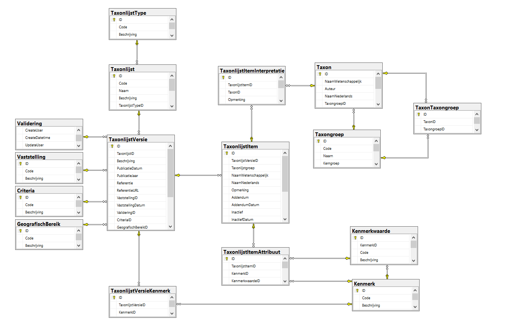

# How to retrieve data from the Taxonlijsten database

## Introduction

What is the most recent Red List status of a species? Which species
occur in which annex of the Habitat Directive? Which species are typical
for a certain habitat? It is a cumbersome task to gather this kind of
information and even more so to keep it up to date. Moreover, many
versions of the truth seem to be wandering around when it comes to taxon
lists.

And unfortunately, there are more problems. Taxon lists sometimes
contain taxonomically diffuse information, that needs interpretation by
the user. In the list ‘Soortenbesluit’ for example, we find items like
‘libellen: alle soorten met uitzondering van die welke specifiek in deze
bijlage worden vermeld’. It requires expert background knowledge to know
which species are actually concerned.

The Taxonlijsten database is a centralized INBO sql server database
where the original taxonlists are stored and maintained, but also the
interpretations of the taxa, ensuring that everyone within INBO uses the
same translation.

## Aim

We provide functions to query data directly from the Taxonlijsten
SQL-server database `[INBO-SQL07-PRD\\LIVE].[D0156_00_Taxonlijsten]`:

- taxonlists (an overview of all available taxonlists)
- features (an overview of all features related to the taxonlists)
- taxonlist items (core function to retrieve (interpreted) taxa on a
  taxonlist)

## Data issues or missing taxonlist

If you notice data issues or there is a `Taxonlijst` missing that you
would like to be included in the database, please contact
<dirk.maes@inbo.be>

## Packages and connection

The functions that we use in this tutorial all start with
`get_taxonlijsten_*`. They are made available by loading the `inbodb`
package.

``` r

library(inbodb)
library(dplyr)
library(tidyr)
library(DBI)
library(knitr)
library(kableExtra)
```

These functions will only work for people with access to the INBO
network. The following R-code can be used to connect to the database
`D0156_00_Taxonlijsten` on the `inbo-sql07-prd`-server:

``` r

con <- connect_inbo_dbase("D0156_00_Taxonlijsten")
```

## Functionality

### Taxonlists overview

The function
[`get_taxonlijsten_lists()`](https://inbo.github.io/inbodb/reference/get_taxonlijsten_lists.md)
queries `D0156_00_Taxonlijsten` and gives an overview of all the
taxonlists and taxonlist versions available in the database. Only the
latest version is shown (unless specified otherwise).

The following examples can be used as base to continue selecting the
data you require.

Get the most recent version of the ‘Rode lijst van de Dagvlinders’:

``` r

rl_dagvlinders <- get_taxonlijsten_lists(
  con,
  list = "%rode%dagvlinders%",
  collect = TRUE
)
```

``` r

rl_dagvlinders
#> # A tibble: 1 × 9
#>   TaxonlijstType TaxonlijstCode Taxonlijst  PublicatieJaar Version ReferentieURL
#>   <chr>          <chr>          <chr>                <int> <chr>   <chr>        
#> 1 RL             NA             Rode lijst…           2021 latest  #https://pur…
#> # ℹ 3 more variables: Criteria <chr>, Validering <chr>, Vaststelling <chr>
```

Get all recent versions of red lists. This time we will not use
`collect = TRUE`, which will return a [lazy
query](https://dbplyr.tidyverse.org/reference/tbl.src_dbi.html):

``` r

rodelijst_recent <- get_taxonlijsten_lists(con, list = "%rode lijst%")
```

Get all (most recent and older) taxonlist versions in the database:

``` r

listversions_all <- get_taxonlijsten_lists(con, version = "all")
```

Red lists need to be validated (= compliant with IUCN criteria) and
authorized by the minister. Get the status of red lists:

``` r

rodelijst_status <- get_taxonlijsten_lists(
  con,
  list = "%rode lijst%",
  collect = TRUE
)  %>%
  select(
    "Taxonlijst", "PublicatieJaar", "Criteria", "Validering",
    "Vaststelling"
  )
```

``` r

rodelijst_status
#> # A tibble: 26 × 5
#>    Taxonlijst                    PublicatieJaar Criteria Validering Vaststelling
#>    <chr>                                  <int> <chr>    <chr>      <chr>       
#>  1 Rode lijst van de Amfibieën             2013 IUCN     Gevalidee… Vastgesteld 
#>  2 Rode lijst van de Bladmossen            2017 IUCN     Gevalidee… Vastgesteld 
#>  3 Rode lijst van de Broedvogels           2016 IUCN     Gevalidee… Vastgesteld 
#>  4 Rode lijst van de Dagvlinders           2021 IUCN     Gevalidee… Vastgesteld 
#>  5 Rode lijst van de Dansvliegen           2001 Lokaal   Niet-geva… Niet-vastge…
#>  6 Rode lijst van de Doodhoutke…           2015 IUCN     Gevalidee… Vastgesteld 
#>  7 Rode lijst van de Hauwmossen            2017 IUCN     Gevalidee… Vastgesteld 
#>  8 Rode lijst van de Landslakken           2006 Lokaal   Niet-geva… Niet-vastge…
#>  9 Rode lijst van de Levermossen           2017 IUCN     Gevalidee… Vastgesteld 
#> 10 Rode lijst van de Libellen              2021 IUCN     Gevalidee… Vastgesteld 
#> # ℹ 16 more rows
```

### Taxonlist features

The function
[`get_taxonlijsten_features()`](https://inbo.github.io/inbodb/reference/get_taxonlijsten_features.md)
queries `D0156_00_Taxonlijsten` and gives an overview of all features
associated with taxa on a taxonlist version. This is an auxiliary
function to check the accepted values (KenmerkwaardeCodes) of the
`feature` parameter in the core function `get_taxonlijsten_items`.

Features are very context (list) dependent: it may be a red list status,
an annex of a legislative list, a habitat, … Not all lists have
associated features, e.g. Soortbeschermingsplannen are (at this moment)
featureless.

The following examples can be used as base to continue selecting the
data you require.

Use function with default values (get all features of the most recent
list versions):

``` r

all_recent <- get_taxonlijsten_features(con)
```

Get features of all versions of the ‘Rode lijst van de Dagvlinders’:

``` r

rl_butterfly <- get_taxonlijsten_features(con, version = "all",
                                          list = "%rode%dagvlinders%",
                                          collect = TRUE)
```

Get features of Habitattypical fauna:

``` r

habitat_fauna <- get_taxonlijsten_features(con, list = "%Habitattyp%fauna%")
```

Note that the function also returns taxonlists without features:

``` r

no_feature <- get_taxonlijsten_features(con, list = "%SBP%", collect = TRUE)
```

``` r

no_feature
#> # A tibble: 27 × 7
#>    Taxonlijst             PublicatieJaar Version KenmerkCode KenmerkBeschrijving
#>    <chr>                           <int> <chr>   <chr>       <chr>              
#>  1 SBP Akkervogels                  2021 latest  NA          NA                 
#>  2 SBP Beekprik, rivierd…           2017 latest  NA          NA                 
#>  3 SBP Bever                        2015 latest  NA          NA                 
#>  4 SBP Boomkikker                   2018 latest  NA          NA                 
#>  5 SBP Bruine kiekendief            2018 latest  NA          NA                 
#>  6 SBP Gladde slang                 2016 latest  NA          NA                 
#>  7 SBP Grauwe kiekendief            2015 latest  NA          NA                 
#>  8 SBP Grauwe klauwier              2017 latest  NA          NA                 
#>  9 SBP Grote modderkruip…           2020 latest  NA          NA                 
#> 10 SBP Hamster                      2015 latest  NA          NA                 
#> # ℹ 17 more rows
#> # ℹ 2 more variables: KenmerkwaardeCode <chr>, KenmerkwaardeBeschrijving <chr>
```

### Taxonlist items

The function
[`get_taxonlijsten_items()`](https://inbo.github.io/inbodb/reference/get_taxonlijsten_items.md)
queries `D0156_00_Taxonlijsten` and returns the taxa (list items) that
are on a taxonlist. The interpreted taxa are given by default, but it is
possible to add taxa as they were originally published.

Several examples are given, this can be used as base to continue
selecting the data you require.

Get all taxa from list ‘Jachtdecreet’:

``` r

jachtdecreet <- get_taxonlijsten_items(con, list =  "Jachtdecreet",
                                       collect = TRUE)
```

Get all taxa on category 2 of ‘Soortenbesluit’:

``` r

soortenbesluit_cat2 <- get_taxonlijsten_items(con, list =  "soortenbesluit",
                                              feature = "cat2")
```

Get all taxonlist that include ‘Gentiaanblauwtje’ (you can search for
scientific as well as Dutch names):

``` r

gentiaanblauwtje <- get_taxonlijsten_items(con, taxon = "Gentiaanblauwtje",
                                           collect = TRUE)
```

``` r

gentiaanblauwtje
#> # A tibble: 10 × 10
#>    Lijst    Publicatiejaar LaatsteVersie Taxongroep Naamwet_interpretatie Auteur
#>    <chr>             <int>         <int> <chr>      <chr>                 <chr> 
#>  1 Ecoprof…           2014             1 Dagvlinde… Phengaris alcon       NA    
#>  2 Habitat…           2013             1 Dagvlinde… Phengaris alcon       NA    
#>  3 Provinc…           2021             1 Dagvlinde… Phengaris alcon       NA    
#>  4 Provinc…           2021             1 Dagvlinde… Phengaris alcon       NA    
#>  5 Rode li…           2021             1 Dagvlinde… Phengaris alcon       NA    
#>  6 Soorten…           2009             1 Dagvlinde… Phengaris alcon       NA    
#>  7 Soorten…           2014             1 Dagvlinde… Phengaris alcon       NA    
#>  8 Subsidi…           2017             1 Dagvlinde… Phengaris alcon       NA    
#>  9 Subsidi…           2017             1 Dagvlinde… Phengaris alcon       NA    
#> 10 Subsidi…           2017             1 Dagvlinde… Phengaris alcon       NA    
#> # ℹ 4 more variables: NaamNed_interpretatie <chr>, Kenmerk <chr>,
#> #   KenmerkwaardeCode <chr>, Kenmerkwaarde <chr>
```

Get all taxa with status CR (critically endangered) from the Red list of
Vascular plants (use function
[`get_taxonlijsten_features()`](https://inbo.github.io/inbodb/reference/get_taxonlijsten_features.md)
to see what feature codes are available):

``` r

critical <- get_taxonlijsten_items(con, feature = "CR",
                                   list = "Rode lijst%vaatpl%")
```

Get original and interpreted Cicindela taxa from list ‘Soortenbesluit’

``` r

cicindela <- get_taxonlijsten_items(
  con, list = "Soortenbesluit",
  taxon = "%Cicindela%", original = TRUE,
  collect = TRUE
) %>%
  select(
    "Naamwet_origineel", "NaamNed_origineel", "Naamwet_interpretatie",
    "NaamNed_interpretatie"
  )
```

``` r

cicindela
#> # A tibble: 5 × 4
#>   Naamwet_origineel   NaamNed_origineel             Naamwet_interpretatie
#>   <chr>               <chr>                         <chr>                
#> 1 Cicindela germanica NA                            Cicindela germanica  
#> 2 Cicindela spp       zandloopkevers - alle soorten Cicindela campestris 
#> 3 Cicindela spp       zandloopkevers - alle soorten Cicindela hybrida    
#> 4 Cicindela spp       zandloopkevers - alle soorten Cicindela maritima   
#> 5 Cicindela sylvatica NA                            Cicindela sylvatica  
#> # ℹ 1 more variable: NaamNed_interpretatie <chr>
```

Compare red list status on multiple list versions:

``` r

redlist_evolution <- get_taxonlijsten_items(
  con, version = "all",
  list = "rode lijst van de dagvlinders",
  collect = TRUE
) %>%
  select(
    "Lijst", "Publicatiejaar", "Naamwet_interpretatie",
    "NaamNed_interpretatie", "KenmerkwaardeCode"
  ) %>%
  pivot_wider(names_from = "Publicatiejaar", values_from = "KenmerkwaardeCode")
```

``` r

redlist_evolution
#> # A tibble: 75 × 6
#>    Lijst        Naamwet_interpretatie NaamNed_interpretatie `1996` `2011` `2021`
#>    <chr>        <chr>                 <chr>                 <chr>  <chr>  <chr> 
#>  1 Rode lijst … Aglais urticae        Kleine vos            LC     NT     EN    
#>  2 Rode lijst … Anthocharis cardamin… Oranjetipje           LC     LC     LC    
#>  3 Rode lijst … Apatura iris          Grote weerschijnvlin… EN     EN     LC    
#>  4 Rode lijst … Aphantopus hyperantus Koevinkje             LC     LC     LC    
#>  5 Rode lijst … Aporia crataegi       Groot geaderd witje   RE     RE     RE    
#>  6 Rode lijst … Araschnia levana      Landkaartje           LC     LC     LC    
#>  7 Rode lijst … Argynnis paphia       Keizersmantel         CR     LC     LC    
#>  8 Rode lijst … Aricia agestis        Bruin blauwtje        VU     LC     LC    
#>  9 Rode lijst … Callophrys rubi       Groentje              VU     VU     EN    
#> 10 Rode lijst … Carterocephalus pala… Bont dikkopje         VU     NT     VU    
#> # ℹ 65 more rows
```

### More complex queries

These functions give most of the relevant basic information that is
available in D0156_00_Taxonlijsten. If you need more, check the data
model below to write your own queries.

## Closing the connection

Close the connection when done

``` r

dbDisconnect(con)
rm(con)
```

## Database philosophy

The diagram below shows the core tables of the database that are
essential to grasp the philosophy behind the data model. Full data model
with short descriptions of tables and fields (in Dutch) is provided at
the end of this document.


Taxonlijsten data model 00.04.00

### Taxonlijst

A `Taxonlijst` is a list of taxa that belong together for one reason or
another. That reason can be legal (Habitats Directive, Birds Directive,
Species Decree, Hunting Decree, etc.), thematic (ecoprofiles, etc.) or
somewhere in between (Red lists, Species Protection Plans). This may
seem pretty straightforward at first glance, but the concept of a
`Taxonlijst` is susceptible to interpretation.

### TaxonlijstVersie

`Taxonlijst` may be revised or updated over time. A typical example is
the 10-yearly revision of the Red Lists. In that case we are talking
about different versions of a `Taxonlijst`.

A `Taxonlijst` has at least one `TaxonlijstVersie`, but it can have
multiple versions. As a rule of thumb a new `Taxonlijstversie` can be
related to a new publication. An example is the Union list of invasive
alien species. This `Taxonlijst` is regularly amended. Each amendment is
considered a new `TaxonlijstVersie` because it can be traced back to a
citable, consolidated version:

| taxonlijstid | taxonlijstversieid | naam | PublicatieJaar | ReferentieURL |
|---:|---:|:---|---:|:---|
| 68 | 90 | Invasieve uitheemse soorten (Unielijst) | 2016 | \#[https://eur-lex.europa.eu/eli/reg_impl/2016/1141/oj/nld##](https://eur-lex.europa.eu/eli/reg_impl/2016/1141/oj/nld##) |
| 68 | 91 | Invasieve uitheemse soorten (Unielijst) | 2017 | \#<https://eur-lex.europa.eu/legal-content/EN/TXT/?uri=CELEX%3A02016R1141-20170802#> |
| 68 | 92 | Invasieve uitheemse soorten (Unielijst) | 2019 | \#<https://eur-lex.europa.eu/legal-content/EN/TXT/?uri=CELEX%3A02016R1141-20190815#> |
| 68 | 93 | Invasieve uitheemse soorten (Unielijst) | 2022 | \#<https://eur-lex.europa.eu/legal-content/EN/TXT/?uri=CELEX%3A02016R1141-20220802#> |

### Taxonlijstitem

All elements (taxa) on a `Taxonlijstversie` are called `TaxonlijstItem`
These are the taxon(group) names **as they were originally published**.
Often this will be species names, but it might as well be a description
of a taxongroup that requires further interpretation. The Species Decree
(Soortenbesluit) for example, includes many descriptive items such as:

- *Cladonia* spp. Subgen. *Cladina* (rendiermossen)
- *Calosoma* spp (poppenrovers - alle soorten)
- *Formica rufa* s.l. (rode bosmier s.l. (kale bosmier, behaarde bosmier
  en zwartrugbosmier))
- *Odonata* (libellen: alle soorten met uitzondering van die welke
  specifiek in deze bijlage worden vermeld)
- …

It also happens that names are published incorrectly (typos, errors in
the authors, incorrect scientific or Dutch name, etc.). Even then, the
names are copied literally as they were published, including errors. An
example: In the Blueprints for species monitoring in Flanders (a list of
Natura 2000 and other Flemish priority species) we find Veenmosorchis -
*Dactylorhiza sphagnicola*. Two different species are confused here,
namely Veenorchis - *Dactylorhiza sphagnicola* and Veenmosorchis -
*Hammarbya paludosa*. We include the incorrect version in the
`TaxonlijstItem` table, the correct interpretation only takes place
afterwards.

A Dutch name may be published without a scientific name or vice versa,
scientific names are published either with or without an author’s name,
it all doesn’t matter: we just copy things as they appear in the
original list. Hence, the `TaxonlijstItem` table always allows you to
recall the list exactly as it was published. There is no direct link
with the `Taxon` table, that link will be made in the table
`TaxonlijstItemInterpretatie`.

### TaxonlijstitemInterpretatie

This table links the name as it was originally published
(`TaxonlijstItem`) with one or more taxa. We call this link the
interpretation of the original name. Usually the interpretation will be
unambiguous and one-to-one, but in other cases a translation must be
done. For example, the reindeer mosses from the example above refer to 6
species occurring in Flanders:

| Lijst | PublicatieJaar | NaamWet | NaamNed | NaamWet_interpretatie | Auteur | NaamNed_interpretatie | taxongroep |
|:---|---:|:---|:---|:---|:---|:---|:---|
| Soortenbesluit | 2009 | Cladonia spp. Subgen. Cladina | rendiermossen | Cladonia arbuscula | (Wallr.) Flot. | Gebogen rendiermos | Korstmossen |
| Soortenbesluit | 2009 | Cladonia spp. Subgen. Cladina | rendiermossen | Cladonia ciliata | Stirt. | Sierlijk rendiermos | Korstmossen |
| Soortenbesluit | 2009 | Cladonia spp. Subgen. Cladina | rendiermossen | Cladonia portentosa | (Dufour) Coem. | Open rendiermos | Korstmossen |
| Soortenbesluit | 2009 | Cladonia spp. Subgen. Cladina | rendiermossen | Cladonia rangiferina | (L.) F.H. Wigg. | Echt rendiermos | Korstmossen |
| Soortenbesluit | 2009 | Cladonia spp. Subgen. Cladina | rendiermossen | Cladonia rangiformis | Hoffm. | Vals rendiermos | Korstmossen |
| Soortenbesluit | 2009 | Cladonia spp. Subgen. Cladina | rendiermossen | Cladonia stellaris | (Opiz) Pouzar & Vezda | Kerststukjesrendiermos | Korstmossen |

The erroneous publication of Veenmosorchis - *Dactylorhiza sphagnicola*
is interpreted as follows:

| Lijst | PublicatieJaar | NaamWet | NaamNed | NaamWet_interpretatie | Auteur | NaamNed_interpretatie | taxongroep |
|:---|---:|:---|:---|:---|:---|:---|:---|
| Soortenmeetnetten | 2014 | Dactylorhiza sphagnicola | veenmosorchis | Hammarbya paludosa | (L.) O. Kuntze | Veenmosorchis | Vaatplanten |

In practice, you will usually want to request the interpreted taxa.

The data model only allows one interpretation, so you cannot define
versions of interpretations. That is a pragmatic choice. The intention
is also to interpret taxa down to the species level whenever possible.

### Taxon

This is the reference table with the taxa of this database. When
managing this table, a number of important principles must be taken into
account. The taxon model has been deliberately kept very simple. There
are no taxonomic hierarchies, nor is it possible to define synonymy
between taxa. It is strongly discouraged to maintain more than one
record in the `Taxon` table for a particular taxon. Let’s take the High
Brown Fritillary (Bosrandparelmoervlinder) as an example. This is the
corresponding `Taxon` record:

| NaamWetenschappelijk | Auteur | NaamNederlands |
|----|----|----|
| Fabriciana adippe | (Denis & Schiffermüller, 1775) | Bosrandparelmoervlinder |

The species is also known under the synonym *Argynnis adippe* and was
previously called Adippevlinder in Dutch. So you might be tempted to add
more records in the `Taxon` table:

| NaamWetenschappelijk | Auteur | NaamNederlands |
|----|----|----|
| Fabriciana adippe | (Denis & Schiffermüller, 1775) | Bosrandparelmoervlinder |
| Fabriciana adippe | (Denis & Schiffermüller, 1775) | Adippevlinder |
| Argynnis adippe | (Linnaeus, 1767) | Bosrandparelmoervlinder |
| Argynnis adippe | (Linnaeus, 1767) | Adippevlinder |

But that is not how it works. For each taxon there should be only one
record, i.e. the name that is considered by the administrator of the
`Taxon` table as the currently accepted scientific and currently
accepted Dutch name. Synonyms can of course occur as an original
`TaxonlijstItem`. For example, we see that in the first version of the
Red List of Butterflies the old Dutch name ‘Adippevlinder’ was used. The
second version only contained Dutch names. They are all linked to the
single entry Fabriciana adippe - Bosrandparelmoervlinder in the `Taxon`
table:

| Lijst | Publicatiejaar | Naamwet_origineel | NaamNed_origineel | Naamwet_interpretatie | NaamNed_interpretatie |
|:---|---:|:---|:---|:---|:---|
| Rode lijst van de Dagvlinders | 1996 | Fabriciana adippe | Adippevlinder | Fabriciana adippe | Bosrandparelmoervlinder |
| Rode lijst van de Dagvlinders | 2011 | NA | Bosrandparelmoervlinder | Fabriciana adippe | Bosrandparelmoervlinder |
| Rode lijst van de Dagvlinders | 2021 | Fabriciana adippe | Bosrandparelmoervlinder | Fabriciana adippe | Bosrandparelmoervlinder |

By allowing only one record per taxon in the `Taxon` table, you are sure
to get all relevant lists when requesting an overview for a taxon. The
drawback is that you need to know the currently accepted name.

### Kenmerk (= feature)

The `TaxonlijstItem` that appear on a `TaxonlijstVersion` may or may not
have associated features. Typical examples of features are the Red List
category or the Annex on which a `TaxonlijstItem` is listed. These are
the features that are currently defined in the database:

| Kenmerkcode | Kenmerk                                        |
|:------------|:-----------------------------------------------|
| EP          | Ecoprofiel Handboek Beheerders                 |
| HRL         | Annex van de Habitatrichtlijn                  |
| HT          | Habitattype                                    |
| IAS         | Amendering invasieve uitheemse soorten (IAS)   |
| JU          | Bejaagbaarheid volgens Jachtuitvoeringsbesluit |
| MT          | Type monitoring                                |
| PBS         | Provinciaal belangrijke soorten                |
| RL          | Rode lijst-categorie                           |
| SB          | Categorie van het Soortenbesluit               |
| SU          | Maatregelen uit het subsidiebesluit            |
| VRL         | Annex van de Vogelrichtlijn                    |

### Kenmerkwaarde

Each feature has a set of allowed feature values. The feature value
codes are the input values for the feature argument in
[`get_taxonlijsten_items()`](https://inbo.github.io/inbodb/reference/get_taxonlijsten_items.md):

| Kenmerkcode | kenmerk | kenmerkwaardecode | kenmerkwaarde |
|:---|:---|:---|:---|
| EP | Ecoprofiel Handboek Beheerders | 1 | Dieren van grote akkercomplexen |
| EP | Ecoprofiel Handboek Beheerders | 10 | Dieren van lichtrijke bossen en mozaïeklandschappen |
| EP | Ecoprofiel Handboek Beheerders | 11 | Dieren van structuurrijke, gesloten bossen |
| EP | Ecoprofiel Handboek Beheerders | 12 | Overwinterende vogels van open water |
| EP | Ecoprofiel Handboek Beheerders | 13 | Dieren van vegetatierijke plassen |
| EP | Ecoprofiel Handboek Beheerders | 14 | Moerasvogels |
| EP | Ecoprofiel Handboek Beheerders | 15 | Dieren van poelen |
| EP | Ecoprofiel Handboek Beheerders | 16 | Dieren van voedselarme vennen, vijvers en poelen |
| EP | Ecoprofiel Handboek Beheerders | 17 | Dieren van grote riviervalleien |
| EP | Ecoprofiel Handboek Beheerders | 18 | Dieren van zuivere beken |
| EP | Ecoprofiel Handboek Beheerders | 19 | Vleermuizen |
| EP | Ecoprofiel Handboek Beheerders | 2 | Overwinterende watervogels op graslanden en akkers |
| EP | Ecoprofiel Handboek Beheerders | 3 | Broedvogels van natte graslanden |
| EP | Ecoprofiel Handboek Beheerders | 4 | Dieren van structuurrijke graslanden in een kleinschalig landschap |
| EP | Ecoprofiel Handboek Beheerders | 5 | Dieren van natte, structuurrijke graslanden, ruigten en grote zeggen |
| EP | Ecoprofiel Handboek Beheerders | 6 | Dieren van grote heide-duin-graslandcomplexen |
| EP | Ecoprofiel Handboek Beheerders | 7 | Vlinders en sprinkhanen van schraal grasland |
| EP | Ecoprofiel Handboek Beheerders | 8 | Vlinders en sprinkhanen van structuurrijke heiden |
| EP | Ecoprofiel Handboek Beheerders | 9 | Vogels van voedselarme bos- en heidecomplexen |
| HRL | Annex van de Habitatrichtlijn | II | Bijlage II Habitatrichtlijn - Dier- en plantensoorten van communautair belang voor de instandhouding waarvan aanwijzing van speciale bescherminszones vereist is |
| HRL | Annex van de Habitatrichtlijn | IV | Bijlage IV Habitatrichtlijn - Dier- en plantensoorten van communautair belang die strikt moeten worden beschermd |
| HRL | Annex van de Habitatrichtlijn | V | Bijlage V Habitatrichtlijn - Dier- en plantensoorten van communautair belang waarvoor het onttrekken aan de natuur en de exploitatie aan beheersmaatregelen kunnen worden onderworpen |
| HT | Habitattype | 1110 | Ondiepe zandbanken in zee die altijd onder water liggen |
| HT | Habitattype | 1130 | Estuaria |
| HT | Habitattype | 1140 | Bij eb droogvallende slikwadden en zandplaten |
| HT | Habitattype | 1310 | Eenjarige pioniersvegetaties van slik- en zandgebieden met Salicornia spp. en andere zoutminnende soorten |
| HT | Habitattype | 1310_pol | Binnendijks gelegen Zeekraalvegetaties |
| HT | Habitattype | 1310_zk | Buitendijks gelegen Zeekraalvegetaties |
| HT | Habitattype | 1310_zv | Buitendijks hoog schor met Zeevetmuurvegetaties (Saginion maritimae) |
| HT | Habitattype | 1320 | Schorren met slijkgrasvegetatie (Spartinion maritimae) |
| HT | Habitattype | 1330 | Atlantische schorren (Glauco-Puccinellietalia maritimae) |
| HT | Habitattype | 1330_da | Buitendijkse schorren |
| HT | Habitattype | 1330_hpr | Binnendijkse zilte vegetaties |
| HT | Habitattype | 2110 | Embryonale wandelende duinen |
| HT | Habitattype | 2120 | Wandelende duinen op de strandwal met Ammophila arenaria (“witte duinen”) |
| HT | Habitattype | 2130 | Vastgelegde kustduinen met kruidvegetatie (“grijze duinen”) |
| HT | Habitattype | 2130_had | Duingraslanden van kalkarme milieus |
| HT | Habitattype | 2130_hd | Duingraslanden van kalkrijke milieus |
| HT | Habitattype | 2150 | Atlantische vastgelegde ontkalkte duinen (Calluno-Ulicetae) |
| HT | Habitattype | 2160 | Duinen met Hippophae rhamnoides |
| HT | Habitattype | 2170 | Duinen met Salix repens ssp. argentea (Salicion arenariae) |
| HT | Habitattype | 2180 | Beboste duinen van het Atlantische, continentale en boreale kustgebied |
| HT | Habitattype | 2190 | Vochtige duinvalleien |
| HT | Habitattype | 2190_mp | Duinpannen met kalkminnende vegetaties |
| HT | Habitattype | 2310 | Psammofiele heide met Calluna en Genista |
| HT | Habitattype | 2330 | Open grasland met Corynephorus- en Agrostis-soorten op landduinen |
| HT | Habitattype | 2330_bu | Buntgrasverbond |
| HT | Habitattype | 2330_dw | Dwerghaververbond |
| HT | Habitattype | 3110 | Mineraalarme oligotrofe wateren van de Atlantische zandvlakten (Littorelletalia uniflorae) |
| HT | Habitattype | 3130 | Oligotrofe tot mesotrofe stilstaande wateren met vegetatie behorend tot het Littorelletalia uniflorae en/of Isoëto-Nanojuncetea |
| HT | Habitattype | 3130_aom | Oligotrofe tot mesotrofe vijvers en vennen met pioniersgemeenschappen op de kale oever of in de ondiepe oeverzone (oeverkruidgemeenschappen; Littorelletea) |
| HT | Habitattype | 3130_na | Oevers van tijdelijke of permanente plassen of poelen met eenjarige dwergbiezenvegetaties (Isoëto-Nanojuncetea) |
| HT | Habitattype | 3140 | Kalkhoudende oligo-mesotrofe stilstaande wateren met benthische Chara spp. vegetaties |
| HT | Habitattype | 3150 | Van nature eutrofe meren met vegetatie van het type Magnopotamion of Hydrocharition |
| HT | Habitattype | 3160 | Dystrofe natuurlijke poelen en meren |
| HT | Habitattype | 3260 | Submontane en laaglandrivieren met vegetaties behorend tot het Ranunculion fluitantis en het Callitricho-Batrachion |
| HT | Habitattype | 3270 | Rivieren met slikoevers met vegetaties behorend tot het Chenopodietum rubri p.p. en Bidention p.p. |
| HT | Habitattype | 4010 | Noord-Atlantische vochtige heide met Erica tetralix |
| HT | Habitattype | 4030 | Droge Europese heide |
| HT | Habitattype | 5130 | Juniperus communis-formaties in heide of kalkgrasland |
| HT | Habitattype | 5130_hei | Variant Jeneverbesstruweel in heide |
| HT | Habitattype | 5130_kalk | Variant Jeneverbesstruweel in kalkgrasland |
| HT | Habitattype | 6120 | Kalkminnend grasland op dorre zandbodem |
| HT | Habitattype | 6210 | Droge half-natuurlijke graslanden en struikvormende facies op kalkhoudende bodems (Festuco-Brometalia) |
| HT | Habitattype | 6230 | Soortenrijke heischrale graslanden op arme bodems van berggebieden (en van submontane gebieden in het binnenland van Europa) |
| HT | Habitattype | 6230_ha | Soortenrijke graslanden van het Struisgrasverbond |
| HT | Habitattype | 6230_hmo | Vochtige, heischrale graslanden |
| HT | Habitattype | 6230_hn | Droge, heischrale graslanden |
| HT | Habitattype | 6230_hnk | Droge, kalkrijkere heischrale graslanden (Betonica-Brachypodietum) |
| HT | Habitattype | 6410 | Grasland met Molinia op kalkhoudende, venige of lemige kleibodem (Molinion caeruleae) |
| HT | Habitattype | 6410_mo | Blauwgrasland |
| HT | Habitattype | 6410_ve | Veldrusassociatie (Veldrusgraslanden) |
| HT | Habitattype | 6430 | Voedselrijke zoomvormende ruigten van het laagland en van de montane en alpiene zones |
| HT | Habitattype | 6430_bz | Nitrofiele boszomen met minder algemene plantensoorten |
| HT | Habitattype | 6430_hf | Moerasspireaverbond (Moerasspirearuigten) |
| HT | Habitattype | 6430_hw | Verbond van Harig wilgenroosje |
| HT | Habitattype | 6430_mr | Ruigere rietlanden in zwak brakke omstandigheden met Echte heemst, Moeraslathyrus en/of Moerasmelkdistel (brakke rietvegetaties met Echte heemst ) |
| HT | Habitattype | 6510 | Laaggelegen schraal hooiland (Alopecurus pratensis, Sanguisorba officinalis) |
| HT | Habitattype | 6510_hu | Glanshavergraslanden (Arrhenaterion) |
| HT | Habitattype | 6510_hua | Grote vossenstaartverbond (Alopecurion) |
| HT | Habitattype | 6510_huk | Kalkrijk Kamgrasgrasland (Galio-Trifolietum) |
| HT | Habitattype | 6510_hus | Glanshavergraslanden met Grote pimpernel |
| HT | Habitattype | 7110 | Actief hoogveen |
| HT | Habitattype | 7120 | Aangetast hoogveen waar natuurlijke regeneratie nog mogelijk is |
| HT | Habitattype | 7140 | Overgangs- en trilveen |
| HT | Habitattype | 7140_base | Basenrijk trilveen met Ronde zegge |
| HT | Habitattype | 7140_meso | Mineraalarm, circum-neutraal overgangsveen |
| HT | Habitattype | 7140_mrd | Varen- en/of (veen)mosrijke rietlanden op drijftillen |
| HT | Habitattype | 7140_oli | Oligotroof en zuur overgangsveen |
| HT | Habitattype | 7150 | Slenken in veengronden met vegetatie behorend tot het Rhynchosporion |
| HT | Habitattype | 7210 | Kalkhoudende moerassen met Cladium mariscus en soorten van het Caricion davallianae |
| HT | Habitattype | 7220 | Kalktufbronnen met tufsteenformatie (Cratoneurion) |
| HT | Habitattype | 7230 | Alkalisch laagveen |
| HT | Habitattype | 8310 | Niet voor publiek opengestelde grotten |
| HT | Habitattype | 9110 | Beukenbossen van het type Luzulo-Fagetum |
| HT | Habitattype | 9120 | Atlantische zuurminnende beukenbossen met Ilex en soms ook Taxus in de ondergroei (Quercion robori-petraeae of Ilici-Fagenion) |
| HT | Habitattype | 9130 | Beukenbossen van het type Asperulo-Fagetum |
| HT | Habitattype | 9150 | Midden-Europese kalkminnende beukenbossen behorend tot het Cephalanthero-Fagion |
| HT | Habitattype | 9160 | Sub-Atlantische en midden-Europese wintereikenbossen of eiken-haagbeukbossen behorend tot het Carpinion-Betuli |
| HT | Habitattype | 9190 | Oude zuurminnende eikenbossen op zandvlakten met Quercus robur |
| HT | Habitattype | 91D0 | Veenbossen |
| HT | Habitattype | 91E0 | Bossen op alluviale grond met Alnus glutinosa en Fraxinus excelsior (Alno-Padion, Alnion incanae, Salicion albae) |
| HT | Habitattype | 91E0_bron | Goudveil-Essenbos (Carici-Remotae fraxinetum) |
| HT | Habitattype | 91E0_eutr | Ruigt-Elzenbos (Filipendulo-Alnetum, Macrophorbio-Alnetum, Cirsio-Alnetum) |
| HT | Habitattype | 91E0_meso | Mesotroof broekbos op minder voedselrijke standplaatsen (Carici elongatae-Alnetum) |
| HT | Habitattype | 91E0_oli | Oligotroof broekbos, inclusief Elzen-Berkenbroekbos en Berkenbroekbos (Carici laevigata-Alnetum) |
| HT | Habitattype | 91E0_veb | Beekbegeleidend Vogelkers-Essenbos en Essen-Iepenbos (Pruno-Fraxinetum) |
| HT | Habitattype | 91E0_wvb | Zachthoutooibos (Wilgenvloedbos; Salicetum albae) |
| HT | Habitattype | 91F0 | Gemengde oeverformaties met Quercus robur, Ulmus laevis en Ulmus minor, Fraxinus excelsior of Fraxinus angustifolia, langs de grote rivieren (Ulmenion minoris) |
| IAS | Amendering invasieve uitheemse soorten (IAS) | B | basislijst van het oorspronkelijke IAS-besluit |
| IAS | Amendering invasieve uitheemse soorten (IAS) | M1 | eerste amendering van het IAS-besluit |
| IAS | Amendering invasieve uitheemse soorten (IAS) | M2 | tweede amendering van het IAS-besluit |
| IAS | Amendering invasieve uitheemse soorten (IAS) | M3 | derde amendering van het IAS-besluit |
| JU | Bejaagbaarheid volgens Jachtuitvoeringsbesluit | B | Bejaagbaar |
| JU | Bejaagbaarheid volgens Jachtuitvoeringsbesluit | NB | Niet-bejaagbaar |
| MT | Type monitoring | HM | Synergie (habitatmonitoring) |
| MT | Type monitoring | IS | Inhaalslag |
| MT | Type monitoring | LW | Losse waarnemingen |
| MT | Type monitoring | MN | Meetnet |
| MT | Type monitoring | MNI | Meetnet (integraal) |
| MT | Type monitoring | MNS | Meetnet (steekproef) |
| MT | Type monitoring | TB | Te bepalen |
| PBS | Provinciaal belangrijke soorten | HS | Habitattypische soort |
| PBS | Provinciaal belangrijke soorten | KS | Koestersoort |
| PBS | Provinciaal belangrijke soorten | PS | Prioritaire soort |
| PBS | Provinciaal belangrijke soorten | SS | Symboolsoort |
| RL | Rode lijst-categorie | CR | Critically endangered |
| RL | Rode lijst-categorie | CR | Ernstig bedreigd |
| RL | Rode lijst-categorie | CR | Met uitsterven bedreigd |
| RL | Rode lijst-categorie | CR | Met verdwijning bedreigd |
| RL | Rode lijst-categorie | DD | Bedreigd maar mate waarin ongekend |
| RL | Rode lijst-categorie | DD | Bedreigd, maar niet gekend in welke mate |
| RL | Rode lijst-categorie | DD | Niet geëvalueerd |
| RL | Rode lijst-categorie | DD | Onvoldoende data |
| RL | Rode lijst-categorie | DD | Onvoldoende gekend |
| RL | Rode lijst-categorie | DD | Vermoedelijk bedreigd |
| RL | Rode lijst-categorie | DD | Waarschijnlijk bedreigd |
| RL | Rode lijst-categorie | EN | Bedreigd |
| RL | Rode lijst-categorie | EN | Endangered |
| RL | Rode lijst-categorie | EN | Sterk bedreigd |
| RL | Rode lijst-categorie | LC | Least concern |
| RL | Rode lijst-categorie | LC | Momenteel niet bedreigd |
| RL | Rode lijst-categorie | LC | Momenteel niet in gevaar |
| RL | Rode lijst-categorie | LC | Niet bedreigd |
| RL | Rode lijst-categorie | NA | Niet van toepassing |
| RL | Rode lijst-categorie | NA | Niet-inheemse broedvogel |
| RL | Rode lijst-categorie | NE | Niet geëvalueerd |
| RL | Rode lijst-categorie | NE | Not assessed |
| RL | Rode lijst-categorie | NE | Onregelmatige broedvogel |
| RL | Rode lijst-categorie | NE(CR) | Niet geëvalueerd |
| RL | Rode lijst-categorie | NT | Achteruitgaand |
| RL | Rode lijst-categorie | NT | Bijna in gevaar |
| RL | Rode lijst-categorie | NT | Geografisch beperkt |
| RL | Rode lijst-categorie | NT | Near threatened |
| RL | Rode lijst-categorie | NT | Vatbaar voor bedreiging |
| RL | Rode lijst-categorie | NT | Zeldzaam |
| RL | Rode lijst-categorie | NT | Zeldzaam (vrij zeldzaam) |
| RL | Rode lijst-categorie | NT | Zeldzaam (zeer zeldzaam) |
| RL | Rode lijst-categorie | NT | Zeldzaam (zeldzaam) |
| RL | Rode lijst-categorie | RE | Regionaal uitgestorven |
| RL | Rode lijst-categorie | RE | Regionally extinct |
| RL | Rode lijst-categorie | RE | Uitgestorven |
| RL | Rode lijst-categorie | RE | Uitgestorven in Vlaanderen |
| RL | Rode lijst-categorie | RE | Verdwenen |
| RL | Rode lijst-categorie | RE | Verdwenen uit Vlaanderen en het Brussels Gewest |
| RL | Rode lijst-categorie | VU | Bedreigd |
| RL | Rode lijst-categorie | VU | Kwetsbaar |
| RL | Rode lijst-categorie | VU | Vulnerable |
| SB | Categorie van het Soortenbesluit | cat1 | soorten waarop de basisbeschermingsbepalingen van het besluit van toepassing zijn. Van die beschermingsbepalingen kan worden afgeweken onder de voorwaarden van artikel 20, § 1, § 2 en § 4. Bovendien gelden voor die soorten de aan planologische bestemming verbonden vrijstellingen, vermeld in artikel 11 en 15 |
| SB | Categorie van het Soortenbesluit | cat2 | soorten waarop de basisbeschermingsbepalingen van toepassing zijn. Van die beschermingsbepalingen kan er worden afgeweken onder de voorwaarden van artikel 20, § 1, § 3 en § 4 |
| SB | Categorie van het Soortenbesluit | cat3 | soorten die zijn opgenomen in bijlage IV van de Habitatrichtlijn, en die voorkomen of kunnen voorkomen in het Vlaamse Gewest. Als gevolg van hun aanwezigheid op de vermelde bijlage van de Habitatrichtlijn genieten die soorten van de strengste beschermingsregeling. Van de beschermingsregeling ten aanzien van deze soorten kan worden afgeweken onder de voorwaarden van artikel 20, § 1 en § 4 |
| SB | Categorie van het Soortenbesluit | cat4 | soorten als vermeld in artikel 3, § 2, 3° en 4°, waarop dit besluit alleen van toepassing is als het gaat over aspecten die niet geregeld worden in de jacht- of visserijregelgeving |
| SB | Categorie van het Soortenbesluit | cat5 | soorten die in aanmerking komen voor vervoer als vermeld in artikel 13, 2° |
| SU | Maatregelen uit het subsidiebesluit | 1 | onderhoud van greppels met het oog op slikranden |
| SU | Maatregelen uit het subsidiebesluit | 10 | ruimen van poelen die groter zijn dan 300 m² |
| SU | Maatregelen uit het subsidiebesluit | 11 | traditioneel vijverbeheer kleiner dan 3 ha, met uitsluiting van het ruimen van het slib |
| SU | Maatregelen uit het subsidiebesluit | 12 | traditioneel vijverbeheer groter dan 3 ha, met uitsluiting van het ruimen van het slib |
| SU | Maatregelen uit het subsidiebesluit | 13 | maaien bij traditioneel vijverbeheer |
| SU | Maatregelen uit het subsidiebesluit | 2 | onderhoud van kleine landschapselementen: haag |
| SU | Maatregelen uit het subsidiebesluit | 3 | onderhoud van kleine landschapselementen: houtkant |
| SU | Maatregelen uit het subsidiebesluit | 4 | onderhoud van kleine landschapselementen: knotbomen |
| SU | Maatregelen uit het subsidiebesluit | 5 | onderhoud van kale bodem - microschaal |
| SU | Maatregelen uit het subsidiebesluit | 6 | gefaseerd maaien omwille van ongewervelden |
| SU | Maatregelen uit het subsidiebesluit | 7 | hakhout- of middelhoutbeheer |
| SU | Maatregelen uit het subsidiebesluit | 8 | ruimen van poelen die kleiner zijn dan 100 m² |
| SU | Maatregelen uit het subsidiebesluit | 9 | ruimen van poelen die groter zijn dan 100 m² en maximaal 300 m² zijn |
| VRL | Annex van de Vogelrichtlijn | I | Bijlage I Vogelrichtlijn |

### TaxonlijstItemAttribuut

This is the relation table linking a `TaxonlijstItem` to its feature
values. A `TaxonlijstItem` can have multiple feature values for the same
feature. For example: the moor frog is linked to 3 habitat types on the
taxon list of habitattypical fauna species:

| Lijst | PublicatieJaar | NaamWet_interpretatie | NaamNed_interpretatie | Kenmerk | KenmerkwaardeCode | Kenmerkwaarde |
|:---|---:|:---|:---|:---|:---|:---|
| Habitattypische faunasoorten | 2013 | Rana arvalis | Heikikker | Habitattype | 3110 | Mineraalarme oligotrofe wateren van de Atlantische zandvlakten (Littorelletalia uniflorae) |
| Habitattypische faunasoorten | 2013 | Rana arvalis | Heikikker | Habitattype | 3130 | Oligotrofe tot mesotrofe stilstaande wateren met vegetatie behorend tot het Littorelletalia uniflorae en/of Isoëto-Nanojuncetea |
| Habitattypische faunasoorten | 2013 | Rana arvalis | Heikikker | Habitattype | 3160 | Dystrofe natuurlijke poelen en meren |

## Full data model



Taxonlijsten data model 00.04.00

Table descriptions:

| SchemaName | TableName | Beschrijving |
|:---|:---|:---|
| dbo | Taxon | Lijst met taxa die de verschillende taxonlijsten populeren |
| dbo | Taxongroep | Groepen waartoe een taxon kan behoren, dit kan eender welk type van groepering zijn (functioneel, taxonomisch, administratief, |
| dbo | TaxonTaxongroep | Koppeltabel tussen de taxa en de taxongroepen waartoe een taxon behoort |
| dbo | TaxonlijstType | Codetabel voor het type lijst, bv. Rode lijst, Europese wetgeving, … |
| dbo | Taxonlijst | Taxonlijsten |
| dbo | TaxonlijstVersie | Versie van een taxonlijst. Een typisch voorbeeld is een update van een Rode lijst, dat beschouwen we als een nieuwe versie van |
| dbo | TaxonlijstItem | Items (namen) zoals ze in de oorspronkelijke lijst gepubliceerd werden. Vaak zijn dat soorten, maar het kunnen ook groeptaxa zi |
| dbo | TaxonlijstItemInterpretatie | Niet alle items op een taxonlijst hebben een eenduidige taxonomische betekenis. Soms moet er bepaald worden welke taxa concreet |
| dbo | TaxonlijstItemAttribuut | Aan een taxonlijstitem kunnen ��n of meerdere extra kenmerken gekoppeld zijn, zoals de Rode Lijst-status of de Annex waarto |
| dbo | Kenmerk | Lijst met kenmerken die aan een taxonlijsitem kunnen gekoppeld worden |
| dbo | Kenmerkwaarde | Lijst met toegestane waardes voor categorische kenmerken |
| dbo | TaxonlijstVersieKenmerk | NA |
| dbo | Vaststelling | Codetabel voor rode lijsten - status van vaststelling |
| dbo | Validering | Codetabel voor rode lijsten - status van de validering |
| dbo | Criteria | Codetabel voor rode lijsten - criteria die gebruikt zijn bij de opmaak van de lijstversie |
| dbo | GeografischBereik | Codetabel - geografisch bereik waarop de lijstversie van toepassing is |

Field descriptions:

| SchemaName | TableName | ColumnName | Beschrijving | DataType | Nullable | PrimaryKey |
|:---|:---|:---|:---|:---|:---|---:|
| dbo | Taxon | ID | Technical id - primary key | int | FALSE | 1 |
| dbo | Taxon | NaamWetenschappelijk | wetenschappelijke naam van het taxon | nvarchar | FALSE | 0 |
| dbo | Taxon | Auteur | auteur van de wetenschappelijke naam | nvarchar | TRUE | 0 |
| dbo | Taxon | NaamNederlands | nederlandse naam van het taxon | nvarchar | TRUE | 0 |
| dbo | Taxon | TaxongroepID | verwijzing naar de meest gebruikelijke taxongroep bij rapportering van een taxon. In de refererende tabel Taxongroep hebben de | int | TRUE | 0 |
| dbo | Taxon | CreateUser | Technical field - who created the record | nvarchar | FALSE | 0 |
| dbo | Taxon | CreateDatetime | Technical field - when was the record created | datetime2 | FALSE | 0 |
| dbo | Taxon | UpdateUser | Technical field - who did the last update of the record | nvarchar | TRUE | 0 |
| dbo | Taxon | UpdateDatetime | Technical field - when was the record last updated | datetime2 | TRUE | 0 |
| dbo | Taxon | RV | technical field - row version | timestamp | FALSE | 0 |
| dbo | Taxongroep | ID | Technical id - primary key | int | FALSE | 1 |
| dbo | Taxongroep | Code | Business-code | nvarchar | TRUE | 0 |
| dbo | Taxongroep | Naam | naam van de taxongroep | nvarchar | FALSE | 0 |
| dbo | Taxongroep | Kerngroep | bitveld dat bepaalt welke taxongroepen gebruikt kunnen worden in de tabel Taxon | bit | FALSE | 0 |
| dbo | Taxongroep | CreateUser | Technical field - who created the record | nvarchar | FALSE | 0 |
| dbo | Taxongroep | CreateDatetime | Technical field - when was the record created | datetime2 | FALSE | 0 |
| dbo | Taxongroep | UpdateUser | Technical field - who did the last update of the record | nvarchar | TRUE | 0 |
| dbo | Taxongroep | UpdateDatetime | Technical field - when was the record last updated | datetime2 | TRUE | 0 |
| dbo | Taxongroep | RV | technical field - row version | timestamp | FALSE | 0 |
| dbo | TaxonTaxongroep | ID | Technical id - primary key | int | FALSE | 1 |
| dbo | TaxonTaxongroep | TaxonID | verwijzing naar het taxon dat op de betreffende taxongroep staat | int | FALSE | 0 |
| dbo | TaxonTaxongroep | TaxongroepID | verwijzing naar de taxongroep waartoe een taxon behoort | int | FALSE | 0 |
| dbo | TaxonTaxongroep | CreateUser | Technical field - who created the record | nvarchar | FALSE | 0 |
| dbo | TaxonTaxongroep | CreateDatetime | Technical field - when was the record created | datetime2 | FALSE | 0 |
| dbo | TaxonTaxongroep | UpdateUser | Technical field - who did the last update of the record | nvarchar | TRUE | 0 |
| dbo | TaxonTaxongroep | UpdateDatetime | Technical field - when was the record last updated | datetime2 | TRUE | 0 |
| dbo | TaxonTaxongroep | RV | technical field - row version | timestamp | FALSE | 0 |
| dbo | TaxonlijstType | ID | Technical id - primary key | int | FALSE | 1 |
| dbo | TaxonlijstType | Code | Business-code | nvarchar | TRUE | 0 |
| dbo | TaxonlijstType | Beschrijving | vrij tekstveld met beschrijving van de inhoud van een record | nvarchar | FALSE | 0 |
| dbo | TaxonlijstType | CreateUser | Technical field - who created the record | nvarchar | FALSE | 0 |
| dbo | TaxonlijstType | CreateDatetime | Technical field - when was the record created | datetime2 | FALSE | 0 |
| dbo | TaxonlijstType | UpdateUser | Technical field - who did the last update of the record | nvarchar | TRUE | 0 |
| dbo | TaxonlijstType | UpdateDatetime | Technical field - when was the record last updated | datetime2 | TRUE | 0 |
| dbo | TaxonlijstType | RV | technical field - row version | timestamp | FALSE | 0 |
| dbo | Taxonlijst | ID | Technical id - primary key | int | FALSE | 1 |
| dbo | Taxonlijst | Code | Business-code | nvarchar | TRUE | 0 |
| dbo | Taxonlijst | Naam | naam van de taxonlijst | nvarchar | FALSE | 0 |
| dbo | Taxonlijst | Beschrijving | vrij tekstveld met beschrijving van de inhoud van een record | nvarchar | TRUE | 0 |
| dbo | Taxonlijst | TaxonlijstTypeID | verwijzing naar het taxonlijsttype | int | TRUE | 0 |
| dbo | Taxonlijst | CreateUser | Technical field - who created the record | nvarchar | FALSE | 0 |
| dbo | Taxonlijst | CreateDatetime | Technical field - when was the record created | datetime2 | FALSE | 0 |
| dbo | Taxonlijst | UpdateUser | Technical field - who did the last update of the record | nvarchar | TRUE | 0 |
| dbo | Taxonlijst | UpdateDatetime | Technical field - when was the record last updated | datetime2 | TRUE | 0 |
| dbo | Taxonlijst | RV | technical field - row version | timestamp | FALSE | 0 |
| dbo | TaxonlijstVersie | ID | Technical id - primary key | int | FALSE | 1 |
| dbo | TaxonlijstVersie | TaxonlijstID | verwijzing naar de taxonlijst waarvan dit een lijstversie is | int | FALSE | 0 |
| dbo | TaxonlijstVersie | Beschrijving | vrij tekstveld met beschrijving van de inhoud van een record | nvarchar | TRUE | 0 |
| dbo | TaxonlijstVersie | PublicatieDatum | datum waarop de lijstversie gepubliceerd werd | datetime | TRUE | 0 |
| dbo | TaxonlijstVersie | PublicatieJaar | jaar waarin de lijstversie gepubliceerd werd | int | FALSE | 0 |
| dbo | TaxonlijstVersie | Referentie | bibliografische referentie van de lijstversie | nvarchar | TRUE | 0 |
| dbo | TaxonlijstVersie | ReferentieURL | link naar de publicatie van de lijstversie | nvarchar | TRUE | 0 |
| dbo | TaxonlijstVersie | VaststellingID | verwijzing naar de vaststellingsstatus van een Rode lijst | int | TRUE | 0 |
| dbo | TaxonlijstVersie | VaststellingDatum | datum waarop de Rode lijst door de bevoegde minister werd vastgesteld | datetime | TRUE | 0 |
| dbo | TaxonlijstVersie | ValideringID | verwijzing naar de valideringsstatus van een Rode lijst | int | TRUE | 0 |
| dbo | TaxonlijstVersie | CriteriaID | verwijzing naar de criteria die gebruikt werden voor de opmaak van een Rode lijst (IUCN, expertoordeel …) | int | TRUE | 0 |
| dbo | TaxonlijstVersie | GeografischBereikID | verwijzing naar de geografische range waarop de lijst betrekking heeft (Vlaanderen, Belgi�, een provincie, …) | int | TRUE | 0 |
| dbo | TaxonlijstVersie | CreateUser | Technical field - who created the record | nvarchar | FALSE | 0 |
| dbo | TaxonlijstVersie | CreateDatetime | Technical field - when was the record created | datetime2 | FALSE | 0 |
| dbo | TaxonlijstVersie | UpdateUser | Technical field - who did the last update of the record | nvarchar | TRUE | 0 |
| dbo | TaxonlijstVersie | UpdateDatetime | Technical field - when was the record last updated | datetime2 | TRUE | 0 |
| dbo | TaxonlijstVersie | RV | technical field - row version | timestamp | FALSE | 0 |
| dbo | TaxonlijstItem | ID | Technical id - primary key | int | FALSE | 1 |
| dbo | TaxonlijstItem | TaxonlijstVersieID | verwijzing naar de taxonlijstversie waarop het taxonlijstitem staat | int | FALSE | 0 |
| dbo | TaxonlijstItem | Taxonlijstgroep | taxongroep waartoe het taxon behoort, maar specifiek zoals gepubliceerd in deze lijst. In het soortenbesluit kan een soort bijv | nvarchar | TRUE | 0 |
| dbo | TaxonlijstItem | NaamWetenschappelijk | wetenschappelijke naam van het taxon zoals gepubliceerd in de lijst (inclusief auteur indien deze mee gepubliceerd is) | nvarchar | TRUE | 0 |
| dbo | TaxonlijstItem | NaamNederlands | nederlandse naam van het taxon zoals gepubliceerd in de lijst | nvarchar | TRUE | 0 |
| dbo | TaxonlijstItem | Opmerking | vrij tekstveld voor opmerkingen bij een record | nvarchar | TRUE | 0 |
| dbo | TaxonlijstItem | Addendum | bit-veld - staat op true als het taxon niet in de oorspronkelijk gepubliceerde lijst stond maar achteraf werd toegevoegd (zonde | bit | FALSE | 0 |
| dbo | TaxonlijstItem | AddendumDatum | datum waarop de addendum-soort werd toegevoegd aan de lijst | datetime | TRUE | 0 |
| dbo | TaxonlijstItem | Inactief | bit-veld - staat op true als een taxon niet meer tot de oorspronkelijk gepubliceerde lijst behoort (zonder dat het om een echte | bit | FALSE | 0 |
| dbo | TaxonlijstItem | InactiefDatum | datum waarop de soort op inactief werd gezet | datetime | TRUE | 0 |
| dbo | TaxonlijstItem | CreateUser | Technical field - who created the record | nvarchar | FALSE | 0 |
| dbo | TaxonlijstItem | CreateDatetime | Technical field - when was the record created | datetime2 | FALSE | 0 |
| dbo | TaxonlijstItem | UpdateUser | Technical field - who did the last update of the record | nvarchar | TRUE | 0 |
| dbo | TaxonlijstItem | UpdateDatetime | Technical field - when was the record last updated | datetime2 | TRUE | 0 |
| dbo | TaxonlijstItem | RV | technical field - row version | timestamp | FALSE | 0 |
| dbo | TaxonlijstItemInterpretatie | ID | Technical id - primary key | int | FALSE | 1 |
| dbo | TaxonlijstItemInterpretatie | TaxonlijstItemID | verwijzing naar het taxonlijstitem dat ge�nterpreteerd moet worden | int | FALSE | 0 |
| dbo | TaxonlijstItemInterpretatie | TaxonID | verwijzing naar de taxon-tabel - dit is dus de eigenlijke interpretatie van het taxonlijsitem. Als het taxonlijsitem bijvoorbee | int | FALSE | 0 |
| dbo | TaxonlijstItemInterpretatie | Opmerking | vrij tekstveld voor opmerkingen bij een record | nvarchar | TRUE | 0 |
| dbo | TaxonlijstItemInterpretatie | CreateUser | Technical field - who created the record | nvarchar | FALSE | 0 |
| dbo | TaxonlijstItemInterpretatie | CreateDatetime | Technical field - when was the record created | datetime2 | FALSE | 0 |
| dbo | TaxonlijstItemInterpretatie | UpdateUser | Technical field - who did the last update of the record | nvarchar | TRUE | 0 |
| dbo | TaxonlijstItemInterpretatie | UpdateDatetime | Technical field - when was the record last updated | datetime2 | TRUE | 0 |
| dbo | TaxonlijstItemInterpretatie | RV | technical field - row version | timestamp | FALSE | 0 |
| dbo | TaxonlijstItemAttribuut | ID | Technical id - primary key | int | FALSE | 1 |
| dbo | TaxonlijstItemAttribuut | TaxonlijstItemID | verwijzing naar het taxonlijstitem waar het attribuut betrekking op heeft | int | FALSE | 0 |
| dbo | TaxonlijstItemAttribuut | KenmerkID | verwijzing naar het kenmerk van het taxonlijstitem (bv. Rode lijst-categorie) | int | FALSE | 0 |
| dbo | TaxonlijstItemAttribuut | KenmerkwaardeID | verwijzing naar de kenmerkwaarde van het taxonlijsitem (bv. ‘Ernstig bedreigd’) | int | FALSE | 0 |
| dbo | TaxonlijstItemAttribuut | CreateUser | Technical field - who created the record | nvarchar | FALSE | 0 |
| dbo | TaxonlijstItemAttribuut | CreateDatetime | Technical field - when was the record created | datetime2 | FALSE | 0 |
| dbo | TaxonlijstItemAttribuut | UpdateUser | Technical field - who did the last update of the record | nvarchar | TRUE | 0 |
| dbo | TaxonlijstItemAttribuut | UpdateDatetime | Technical field - when was the record last updated | datetime2 | TRUE | 0 |
| dbo | TaxonlijstItemAttribuut | RV | technical field - row version | timestamp | FALSE | 0 |
| dbo | Kenmerk | ID | Technical id - primary key | int | FALSE | 1 |
| dbo | Kenmerk | Code | Business-code | nvarchar | FALSE | 0 |
| dbo | Kenmerk | Beschrijving | vrij tekstveld met beschrijving van de inhoud van een record | nvarchar | FALSE | 0 |
| dbo | Kenmerk | CreateUser | Technical field - who created the record | nvarchar | FALSE | 0 |
| dbo | Kenmerk | CreateDatetime | Technical field - when was the record created | datetime2 | FALSE | 0 |
| dbo | Kenmerk | UpdateUser | Technical field - who did the last update of the record | nvarchar | TRUE | 0 |
| dbo | Kenmerk | UpdateDatetime | Technical field - when was the record last updated | datetime2 | TRUE | 0 |
| dbo | Kenmerk | RV | technical field - row version | timestamp | FALSE | 0 |
| dbo | Kenmerkwaarde | ID | Technical id - primary key | int | FALSE | 1 |
| dbo | Kenmerkwaarde | KenmerkID | verwijzing naar het taxonkenmerk waarop de kenmerkwaarde betrekking heeft | int | FALSE | 0 |
| dbo | Kenmerkwaarde | Code | Business-code | nvarchar | FALSE | 0 |
| dbo | Kenmerkwaarde | Beschrijving | vrij tekstveld met beschrijving van de inhoud van een record | nvarchar | FALSE | 0 |
| dbo | Kenmerkwaarde | CreateUser | Technical field - who created the record | nvarchar | FALSE | 0 |
| dbo | Kenmerkwaarde | CreateDatetime | Technical field - when was the record created | datetime2 | FALSE | 0 |
| dbo | Kenmerkwaarde | UpdateUser | Technical field - who did the last update of the record | nvarchar | TRUE | 0 |
| dbo | Kenmerkwaarde | UpdateDatetime | Technical field - when was the record last updated | datetime2 | TRUE | 0 |
| dbo | Kenmerkwaarde | RV | technical field - row version | timestamp | FALSE | 0 |
| dbo | TaxonlijstVersieKenmerk | ID | Technical id - primary key | int | FALSE | 1 |
| dbo | TaxonlijstVersieKenmerk | TaxonlijstVersieID | verwijzing naar de taxonlijstversie waarop de kenmerken van toepassing zijn | int | FALSE | 0 |
| dbo | TaxonlijstVersieKenmerk | KenmerkID | verwijzing naar de kenmerken die voor een lijst van toepassing zijn | int | FALSE | 0 |
| dbo | TaxonlijstVersieKenmerk | CreateUser | Technical field - who created the record | nvarchar | FALSE | 0 |
| dbo | TaxonlijstVersieKenmerk | CreateDatetime | Technical field - when was the record created | datetime2 | FALSE | 0 |
| dbo | TaxonlijstVersieKenmerk | UpdateUser | Technical field - who did the last update of the record | nvarchar | TRUE | 0 |
| dbo | TaxonlijstVersieKenmerk | UpdateDatetime | Technical field - when was the record last updated | datetime2 | TRUE | 0 |
| dbo | TaxonlijstVersieKenmerk | RV | technical field - row version | timestamp | FALSE | 0 |
| dbo | Vaststelling | ID | Technical id - primary key | int | FALSE | 1 |
| dbo | Vaststelling | Code | Business-code | nvarchar | TRUE | 0 |
| dbo | Vaststelling | Beschrijving | vrij tekstveld met beschrijving van de inhoud van een record | nvarchar | FALSE | 0 |
| dbo | Vaststelling | CreateUser | Technical field - who created the record | nvarchar | FALSE | 0 |
| dbo | Vaststelling | CreateDatetime | Technical field - when was the record created | datetime2 | FALSE | 0 |
| dbo | Vaststelling | UpdateUser | Technical field - who did the last update of the record | nvarchar | TRUE | 0 |
| dbo | Vaststelling | UpdateDatetime | Technical field - when was the record last updated | datetime2 | TRUE | 0 |
| dbo | Vaststelling | RV | technical field - row version | timestamp | FALSE | 0 |
| dbo | Validering | ID | Technical id - primary key | int | FALSE | 1 |
| dbo | Validering | Code | Business-code | nvarchar | TRUE | 0 |
| dbo | Validering | Beschrijving | vrij tekstveld met beschrijving van de inhoud van een record | nvarchar | FALSE | 0 |
| dbo | Validering | CreateUser | Technical field - who created the record | nvarchar | FALSE | 0 |
| dbo | Validering | CreateDatetime | Technical field - when was the record created | datetime2 | FALSE | 0 |
| dbo | Validering | UpdateUser | Technical field - who did the last update of the record | nvarchar | TRUE | 0 |
| dbo | Validering | UpdateDatetime | Technical field - when was the record last updated | datetime2 | TRUE | 0 |
| dbo | Validering | RV | technical field - row version | timestamp | FALSE | 0 |
| dbo | Criteria | ID | Technical id - primary key | int | FALSE | 1 |
| dbo | Criteria | Code | Business-code | nvarchar | TRUE | 0 |
| dbo | Criteria | Beschrijving | vrij tekstveld met beschrijving van de inhoud van een record | nvarchar | FALSE | 0 |
| dbo | Criteria | CreateUser | Technical field - who created the record | nvarchar | FALSE | 0 |
| dbo | Criteria | CreateDatetime | Technical field - when was the record created | datetime2 | FALSE | 0 |
| dbo | Criteria | UpdateUser | Technical field - who did the last update of the record | nvarchar | TRUE | 0 |
| dbo | Criteria | UpdateDatetime | Technical field - when was the record last updated | datetime2 | TRUE | 0 |
| dbo | Criteria | RV | technical field - row version | timestamp | FALSE | 0 |
| dbo | GeografischBereik | ID | Technical id - primary key | int | FALSE | 1 |
| dbo | GeografischBereik | Code | Business-code | nvarchar | TRUE | 0 |
| dbo | GeografischBereik | Beschrijving | vrij tekstveld met beschrijving van de inhoud van een record | nvarchar | FALSE | 0 |
| dbo | GeografischBereik | CreateUser | Technical field - who created the record | nvarchar | FALSE | 0 |
| dbo | GeografischBereik | CreateDatetime | Technical field - when was the record created | datetime2 | FALSE | 0 |
| dbo | GeografischBereik | UpdateUser | Technical field - who did the last update of the record | nvarchar | TRUE | 0 |
| dbo | GeografischBereik | UpdateDatetime | Technical field - when was the record last updated | datetime2 | TRUE | 0 |
| dbo | GeografischBereik | RV | technical field - row version | timestamp | FALSE | 0 |
