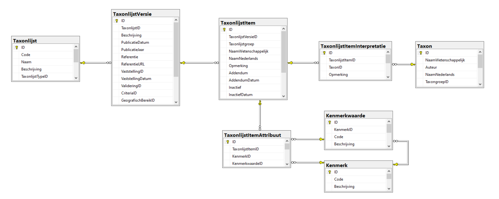
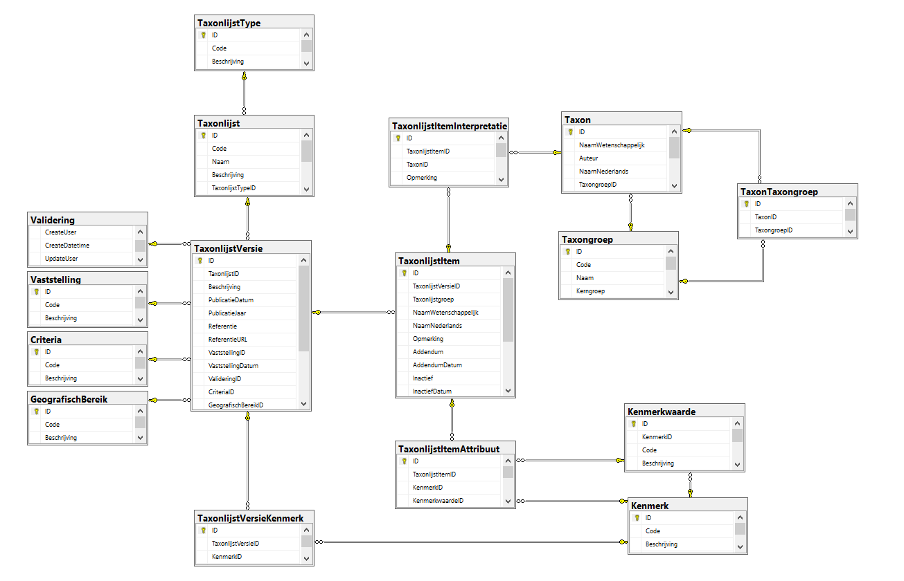

```{r, include = FALSE}
tryCatch(
  con <- inbodb::connect_inbo_dbase("D0156_00_Taxonlijsten"),
  error = function(e) e,
  finally = database_access <- exists("con")
)
knitr::opts_chunk$set(
  collapse = TRUE,
  comment = "#>",
  eval = database_access,
  cache = FALSE,
  message = FALSE
)
if (!database_access) {
  load("get_data_taxonlijsten_results.Rda")
}
```

# Introduction

What is the most recent Red List status of a species? Which species occur in which annex of the Habitat Directive? Which species are typical for a certain habitat?  It is a cumbersome task to gather this kind of information and even more so to keep it up to date. Moreover, many versions of the truth seem to be wandering around when it comes to taxon lists.

And unfortunately, there are more problems. Taxon lists sometimes contain taxonomically diffuse information, that needs interpretation by the user. In the list 'Soortenbesluit' for example, we find items like 'libellen: alle soorten met uitzondering van die welke specifiek in deze bijlage worden vermeld'. It requires expert background knowledge to know which species are actually concerned. 

The Taxonlijsten database is a centralized INBO sql server database where the original taxonlists are stored and maintained, but also the interpretations of the taxa, ensuring that everyone within INBO uses the same translation.


# Aim

We provide functions to query data directly from the Taxonlijsten SQL-server database `[INBO-SQL07-PRD\\LIVE].[D0156_00_Taxonlijsten]`:

* taxonlists (an overview of all available taxonlists)
* features (an overview of all features related to the taxonlists)
* taxonlist items (core function to retrieve (interpreted) taxa on a taxonlist)

# Data issues or missing taxonlist

If you notice data issues or there is a `Taxonlijst` missing that you would like to be included in the database, please contact dirk.maes@inbo.be
  
# Packages and connection

The functions that we use in this tutorial all start with `get_taxonlijsten_*`. 
They are made available by loading the `inbodb` package.

```{r setup}
library(inbodb)
library(dplyr)
library(tidyr)
library(DBI)
library(knitr)
library(kableExtra)
```

These functions will only work for people with access to the INBO network. The following R-code can be used to connect to the database `D0156_00_Taxonlijsten` on the `inbo-sql07-prd`-server:

```{r connection_inbo}
con <- connect_inbo_dbase("D0156_00_Taxonlijsten")
```

# Functionality

## Taxonlists overview
The function `get_taxonlijsten_lists()` queries `D0156_00_Taxonlijsten` and gives an overview of all the taxonlists and taxonlist versions available in the database. Only the latest version is shown (unless specified otherwise).

The following examples can be used as base to continue selecting the data you require.

Get the most recent version of the 'Rode lijst van de Dagvlinders':

```{r , echo=TRUE}
rl_dagvlinders <- get_taxonlijsten_lists(con,
                              list = "%rode%dagvlinders%",
                              collect = TRUE
                           )
```

```{r, eval=TRUE, echo=TRUE}
rl_dagvlinders
```

Get all recent versions of red lists. This time we will not use `collect = TRUE`, which will return a [lazy query](https://docs.lucee.org/guides/cookbooks/lazy_queries.html):

```{r, eval=FALSE, echo=TRUE}
rodelijst_recent <- get_taxonlijsten_lists(con,
                              list = "%rode lijst%"
                           )
```

Get all (most recent and older) taxonlist versions in the database:

```{r, eval=FALSE, echo=TRUE}
listversions_all <- get_taxonlijsten_lists(con,
                              version = "all"
                           )
```

Red lists need to be validated (= compliant with IUCN criteria) and authorized by the minister. Get the status of red lists:

```{r, echo=TRUE}
rodelijst_status <- get_taxonlijsten_lists(con,
                              list = "%rode lijst%",
                              collect = TRUE
                           )  %>%
select("Taxonlijst", "PublicatieJaar", "Criteria", "Validering",
       "Vaststelling")
```

```{r, eval=TRUE, echo=TRUE}
rodelijst_status
```

## Taxonlist features
The function `get_taxonlijsten_features()` queries `D0156_00_Taxonlijsten` and gives an overview of all features associated with taxa on a taxonlist version. This is an auxiliary function to check the accepted values (KenmerkwaardeCodes) of the `feature` parameter in the core function `get_taxonlijsten_items`.

Features are very context (list) dependent: it may be a red list status, an annex of a legislative list, a habitat, ... Not all lists have associated features, e.g. Soortbeschermingsplannen are (at this moment) featureless.

The following examples can be used as base to continue selecting the data you require.

Use function with default values (get all features of the most recent list versions):

```{r, eval=FALSE, echo=TRUE}
all_recent <- get_taxonlijsten_features(con)
```

Get features of all versions of the 'Rode lijst van de Dagvlinders':

```{r, eval=FALSE, echo=TRUE}
rl_butterfly <- get_taxonlijsten_features(con, version = "all",
                                          list = "%rode%dagvlinders%",
                                          collect = TRUE)
```

Get features of Habitattypical fauna:

```{r, eval=FALSE, echo=TRUE}
habitat_fauna <- get_taxonlijsten_features(con, list = "%Habitattyp%fauna%")
```

Note that the function also returns taxonlists without features:

```{r, echo=TRUE}
no_feature <- get_taxonlijsten_features(con, list = "%SBP%", collect = TRUE)
```

```{r, eval=TRUE, echo=TRUE}
no_feature
```

## Taxonlist items
The function  `get_taxonlijsten_items()` queries `D0156_00_Taxonlijsten` and returns the taxa (list items) that are on a taxonlist. The interpreted taxa are given by default, but it is possible to add taxa as they were originally published.

Several examples are given, this can be used as base to continue selecting the data you require.

Get all taxa from list 'Jachtdecreet':

```{r, eval=FALSE, echo=TRUE}
jachtdecreet <- get_taxonlijsten_items(con, list =  "Jachtdecreet",
                                       collect = TRUE)
```

Get all taxa on category 2 of 'Soortenbesluit':

```{r, eval=FALSE, echo=TRUE}
soortenbesluit_cat2 <- get_taxonlijsten_items(con, list =  "soortenbesluit",
                                              feature = "cat2")
```

Get all taxonlist that include 'Gentiaanblauwtje' (you can search for scientific as well as Dutch names):

```{r, echo=TRUE}
gentiaanblauwtje <- get_taxonlijsten_items(con, taxon = "Gentiaanblauwtje",
                                           collect = TRUE)
```

```{r, eval=TRUE, echo=TRUE}
gentiaanblauwtje
```

Get all taxa with status CR (critically endangered) from the Red list of Vascular plants (use function `get_taxonlijsten_features()` to see what feature codes are available):

```{r, eval=FALSE, echo=TRUE}
critical <- get_taxonlijsten_items(con, feature = "CR",
                                   list = "Rode lijst%vaatpl%")
```

Get original and interpreted Cicindela taxa from list 'Soortenbesluit'

```{r, echo=TRUE}
cicindela <- get_taxonlijsten_items(con, list = "Soortenbesluit",
                                    taxon = "%Cicindela%", original = TRUE,
                                    collect = TRUE) %>%
select("Naamwet_origineel", "NaamNed_origineel", "Naamwet_interpretatie",
         "NaamNed_interpretatie")
```

```{r, eval=TRUE, echo=TRUE}
cicindela
```

Compare red list status on multiple list versions:

```{r, echo=TRUE}
redlist_evolution <- get_taxonlijsten_items(con, version = "all",
                                    list = "rode lijst van de dagvlinders",
                                    collect = TRUE) %>%
select("Lijst", "Publicatiejaar", "Naamwet_interpretatie",
         "NaamNed_interpretatie", "KenmerkwaardeCode") %>%
pivot_wider(names_from = "Publicatiejaar", values_from = "KenmerkwaardeCode")
```

```{r, eval=TRUE, echo=TRUE}
redlist_evolution
```

## More complex queries
These functions give most of the relevant basic information that is available in D0156_00_Taxonlijsten. If you need more, check the data model below to write your own queries.

# Closing the connection

Close the connection when done

```{r closing_conn, eval=FALSE}
dbDisconnect(con)
rm(con)
```


# Database philosophy

The diagram below shows the core tables of the database that are essential to grasp the philosophy behind the data model. Full data model with short descriptions of tables and fields (in Dutch) is provided at the end of this document.



## Taxonlijst

A `Taxonlijst` is a list of taxa that belong together for one reason or another. That reason can be legal (Habitats Directive, Birds Directive, Species Decree, Hunting Decree, etc.), thematic (ecoprofiles, etc.) or somewhere in between (Red lists, Species Protection Plans). This may seem pretty straightforward at first glance, but the concept of a `Taxonlijst` is susceptible to interpretation.

## TaxonlijstVersie

`Taxonlijst` may be revised or updated over time. A typical example is the 10-yearly revision of the Red Lists. In that case we are talking about different versions of a `Taxonlijst`. 

A `Taxonlijst` has at least one `TaxonlijstVersie`, but it can have multiple versions. As a rule of thumb a new `Taxonlijstversie` can be related to a new publication. An example is the Union list of invasive alien species. This `Taxonlijst` is regularly amended. Each amendment is considered a new `TaxonlijstVersie` because it can be traced back to a citable, consolidated version:


```{r, echo=FALSE}
tlv <- dbGetQuery(con, "select tl.id as taxonlijstid
           , tlv.id as taxonlijstversieid
           , tl.naam
           , tlv.PublicatieJaar
           , tlv.ReferentieURL
           from taxonlijst tl
           inner join TaxonlijstVersie tlv on tlv.taxonlijstid = tl.id
           where tl.naam like '%Invasieve%Unielijst%'", collect = TRUE)
```

```{r, eval=TRUE, echo=FALSE}
tlv %>%
  kable() %>%
  kable_styling(font_size = 9)
```


## Taxonlijstitem

All elements (taxa) on a `Taxonlijstversie` are called `TaxonlijstItem` These are the taxon(group) names **as they were originally published**. Often this will be species names, but it might as well be a description of a taxongroup that requires further interpretation. The Species Decree (Soortenbesluit) for example, includes many descriptive items such as:

* *Cladonia* spp. Subgen. *Cladina* (rendiermossen)
* *Calosoma* spp (poppenrovers - alle soorten)
* *Formica rufa* s.l.	 (rode bosmier s.l. (kale bosmier, behaarde bosmier en zwartrugbosmier))
* *Odonata* (libellen: alle soorten met uitzondering van die welke specifiek in deze bijlage worden vermeld)
* …

It also happens that names are published incorrectly (typos, errors in the authors, incorrect scientific or Dutch name, etc.). Even then, the names are copied literally as they were published, including errors. An example: In the Blueprints for species monitoring in Flanders (a list of Natura 2000 and other Flemish priority species) we find Veenmosorchis - *Dactylorhiza sphagnicola*. Two different species are confused here, namely Veenorchis - *Dactylorhiza sphagnicola* and Veenmosorchis - *Hammarbya paludosa*. We include the incorrect version in the `TaxonlijstItem` table, the correct interpretation only takes place afterwards.

A Dutch name may be published without a scientific name or vice versa, scientific names are published either with or without an author's name, it all doesn't matter: we just copy things as they appear in the original list. Hence, the `TaxonlijstItem` table always allows you to recall the list exactly as it was published. There is no direct link with the `Taxon` table, that link will be made in the table `TaxonlijstItemInterpretatie`.

## TaxonlijstitemInterpretatie

This table links the name as it was originally published (`TaxonlijstItem`) with one or more taxa. We call this link the interpretation of the original name. Usually the interpretation will be unambiguous and one-to-one, but in other cases a translation must be done. For example, the reindeer mosses from the example above refer to 6 species occurring in Flanders:

```{r, echo=FALSE}
reindeer <- dbGetQuery(con, "select Lijst, PublicatieJaar, NaamWet, NaamNed,
NaamWet_interpretatie, Auteur, NaamNed_interpretatie, taxongroep
from [dbo].[vw_Taxonlijstitem_detail]
where naamwet like '%cladina%' and Lijst = 'Soortenbesluit'", collect = TRUE)
```

```{r, eval=TRUE, echo=FALSE}
reindeer %>%
  kable() %>%
  kable_styling(font_size = 9)
```

The erroneous publication of Veenmosorchis - *Dactylorhiza sphagnicola* is interpreted as follows:

```{r, echo=FALSE}
veenmosorchis <- dbGetQuery(con, "select Lijst, PublicatieJaar, NaamWet,
NaamNed, NaamWet_interpretatie, Auteur, NaamNed_interpretatie, taxongroep
from [dbo].[vw_Taxonlijstitem_detail]
where naamwet like 'Dactylorhiza sphagnicola' and Lijst =
'Soortenmeetnetten'", collect = TRUE)
```

```{r, eval=TRUE, echo=FALSE}
veenmosorchis %>%
  kable() %>%
  kable_styling(font_size = 9)
```

In practice, you will usually want to request the interpreted taxa. 

The data model only allows one interpretation, so you cannot define versions of interpretations. That is a pragmatic choice. The intention is also to interpret taxa down to the species level whenever possible. 

## Taxon

This is the reference table with the taxa of this database. When managing this table, a number of important principles must be taken into account. The taxon model has been deliberately kept very simple. There are no taxonomic hierarchies, nor is it possible to define synonymy between taxa. It is strongly discouraged to maintain more than one record in the `Taxon` table for a particular taxon. Let's take the High Brown Fritillary (Bosrandparelmoervlinder) as an example. This is the corresponding `Taxon` record:

NaamWetenschappelijk | Auteur                       | NaamNederlands
---------------------|------------------------------|------------------------
Fabriciana adippe    |(Denis & Schiffermüller, 1775)| Bosrandparelmoervlinder

The species is also known under the synonym *Argynnis adippe* and was previously called Adippevlinder in Dutch. So you might be tempted to add more records in the `Taxon` table:

NaamWetenschappelijk | Auteur                       | NaamNederlands
---------------------|------------------------------|------------------------
Fabriciana adippe    |(Denis & Schiffermüller, 1775)| Bosrandparelmoervlinder
Fabriciana adippe    |(Denis & Schiffermüller, 1775)| Adippevlinder
Argynnis adippe      |(Linnaeus, 1767)              | Bosrandparelmoervlinder
Argynnis adippe      |(Linnaeus, 1767)              | Adippevlinder

But that is not how it works. For each taxon there should be only one record, i.e. the name that is considered by the administrator of the `Taxon` table as the currently accepted scientific and currently accepted Dutch name. Synonyms can of course occur as an original `TaxonlijstItem`. For example, we see that in the first version of the Red List of Butterflies the old Dutch name 'Adippevlinder' was used. The second version only contained Dutch names. They are all linked to the single entry Fabriciana adippe - Bosrandparelmoervlinder in the `Taxon` table:

```{r, echo=FALSE}
adippe <- get_taxonlijsten_items(con, version = "all",
                       list = "rode lijst van de dagvlinders",
                       taxon = "%adippe%", original = TRUE, collect = TRUE) %>%
  select("Lijst", "Publicatiejaar", "Naamwet_origineel", "NaamNed_origineel",
           "Naamwet_interpretatie", "NaamNed_interpretatie")
```

```{r, eval=TRUE, echo=FALSE}
adippe %>%
  kable() %>%
  kable_styling(font_size = 9)
```

By allowing only one record per taxon in the `Taxon` table, you are sure to get all relevant lists when requesting an overview for a taxon. The drawback is that you need to know the currently accepted name.

## Kenmerk (= feature)

The `TaxonlijstItem` that appear on a `TaxonlijstVersion` may or may not have associated features. Typical examples of features are the Red List category or the Annex on which a `TaxonlijstItem` is listed. These are the features that are currently defined in the database:

```{r, echo=FALSE}
feature <- dbGetQuery(con, "select distinct Kenmerkcode, Kenmerk from
           [dbo].[vw_Kenmerk]", collect = TRUE)
```

```{r, eval=TRUE, echo=FALSE}
feature %>%
  kable() %>%
  kable_styling(font_size = 9)
```

## Kenmerkwaarde

Each feature has a set of allowed feature values. The feature value codes are the input values for the feature argument in `get_taxonlijsten_items()`:

```{r, echo=FALSE}
featurevalue <- dbGetQuery(con, "select Kenmerkcode, kenmerk, kenmerkwaardecode,
           kenmerkwaarde from [dbo].[vw_Kenmerk]", collect = TRUE)
```

```{r, eval=TRUE, echo=FALSE}
featurevalue %>%
  kable() %>%
  kable_styling(font_size = 9)
```

## TaxonlijstItemAttribuut

This is the relation table linking a `TaxonlijstItem` to its feature values. A `TaxonlijstItem` can have multiple feature values for the same feature. For example: the moor frog is linked to 3 habitat types on the taxon list of habitattypical fauna species:

```{r, echo=FALSE}
frog <- dbGetQuery(con, "select Lijst, PublicatieJaar, NaamWet_interpretatie,
NaamNed_interpretatie, Kenmerk, KenmerkwaardeCode, Kenmerkwaarde
from [dbo].[vw_Taxonlijstitem_detail] where NaamNed_interpretatie = 'Heikikker'
and Lijst = 'Habitattypische faunasoorten' and LaatsteVersie = 1",
collect = TRUE)
```

```{r, eval=TRUE, echo=FALSE}
frog %>%
  kable() %>%
  kable_styling(font_size = 9)
```


# Full data model



Table descriptions:

```{r, echo=FALSE}
fulltable <- dbGetQuery(con, "
SELECT schema_name(t.schema_id) SchemaName ,
t.name AS TableName ,
ep2.value AS Beschrijving
FROM sys.tables t
LEFT JOIN sys.extended_properties ep2
ON t.object_id = ep2.major_id
AND ep2.class = 1
AND ep2.minor_id = 0
AND ep2.name = 'Beschrijving'
where schema_name(t.schema_id) = 'dbo'", collect = TRUE)
```

```{r, eval=TRUE, echo=FALSE}
fulltable %>%
  kable() %>%
  kable_styling(font_size = 9)
```

Field descriptions:

```{r, echo=FALSE}
fullfield <- dbGetQuery(con, "
SELECT schema_name(t.schema_id) SchemaName ,
t.name TableName ,
c.name ColumnName ,
ep1.value Beschrijving ,
--c.column_id ColumnID ,
typ.name DataType ,
c.is_NULLable Nullable ,
case when ix.name is null then 0 else 1 end as PrimaryKey
FROM sys.tables t
INNER JOIN sys.columns c
ON t.object_id = c.object_id
INNER JOIN sys.types typ
ON c.system_type_id = typ.system_type_id
AND c.user_type_id = typ.user_type_id
LEFT JOIN
(
sys.indexes ix
INNER JOIN sys.index_columns ixc
ON ix.object_id = ixc.object_id
AND ix.index_id = ixc.index_id
AND ix.is_primary_key = 1
)
ON ix.object_id = c.object_id
AND ixc.column_id = c.column_id
LEFT JOIN sys.extended_properties ep1
ON c.object_id = ep1.major_id
AND ep1.class = 1
AND c.column_id = ep1.minor_id
AND ep1.name = 'Beschrijving'
where schema_name(t.schema_id) = 'dbo'
and t.name not like 'syc%'", collect = TRUE)
```

```{r, eval=TRUE, echo=FALSE}
fullfield %>%
  kable() %>%
  kable_styling(font_size = 9)
```

```{r echo=FALSE, include=FALSE}
dbDisconnect(con)
rm(con)
rm(database_access)
save.image(file = "get_data_taxonlijsten_results.Rda")
```
